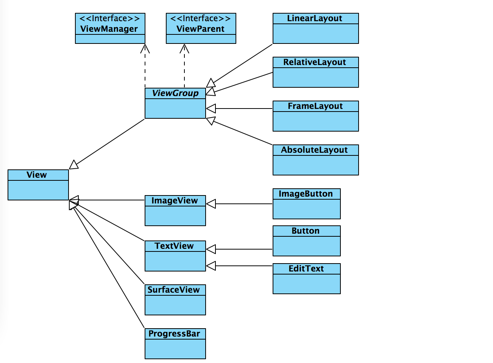
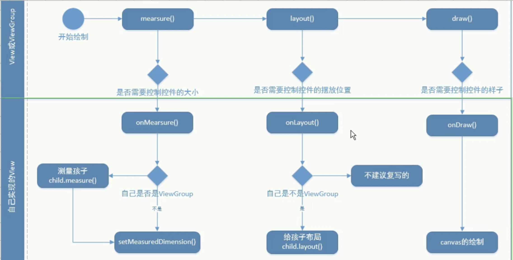
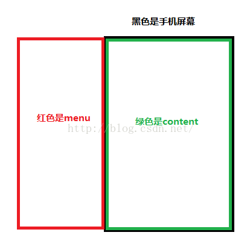
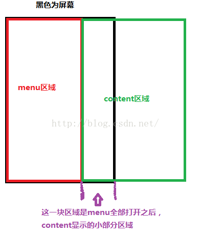
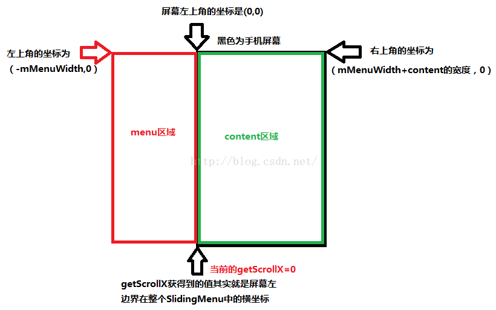
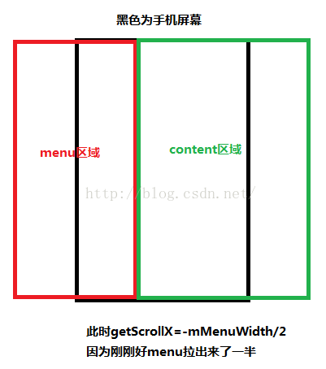
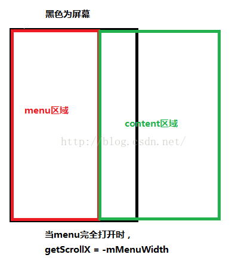

# 自定义控件

1. 原生控件（imageview，button，textview）
2. 自定控件

	1. 组合控件
	2. 自己绘制的控件（绘制，行为操作）

## 1、View和ViewGroup




---
关系view和viewGroup  
继承关系  
组合关系  
		
---
 


	```xml
	<LinearLayout>
		<RelativeLayout>
			<ImageView/>
			<LinearLayout/>
		</RelativeLayout>
		<Button/>
	</LinearLayout>
	```
* 作用
	1. view： 提供实际的功能，提供了绘制的样式
	2. viewGroup：管理子控件，位置，大小

* View的形状： 方形
* 布局的层次： 后布局的在最上面一层
* View的绘制流程（相对性）
	1. mearsue: 测量，final，控制控件的大小
	2. layout： 布局，用来控制自己的布局位置
	3. draw: 绘制，用来控制控件的显示样式

---
view的绘制流程如下:  




```	
	mearsure --> layout ---> draw
	
	1. onMearsure:
	2. onLayout:
	3. onDraw:

	1. setMeasuredDimension(width，height): 用来设置自己的大小
	2. ViewGroup.onMeasure(): 给出孩子的期望大小值，设置自己大小的准确值
```

---

1、 View的行为:  

	1. click,longClick,
	2. dispatchTouchEvent():touch分发,android希望用来处理是否分发touch事件
	3. onInterceptTouchEvent():touch拦截，android希望处理是否拦截touch事件
		1. 是否拦截孩子touch
	4. onTouchEvent(): touch处理， anroid希望开发人员封装触摸行为给用户提供交换
	5. setOnTouchListener():

2、 View的刷新: invalidate() ---> draw() ---> onDraw()
3、回调

	1. setXXXListener设置监听的方法 用提供者创造，用来给 使用者设置监听回调
	2. 提供者 --> onXXXXListener
	3. 提供者 -->调用接口中的方法
	4. 使用者 -->实现接口

4、getWidth 和 getMeasuredWidth

5、 widthMeasureSpec:期望值

	1. 组成： 32位的010101010101011010101组成
	2. 头2位：代表的是模式
		1. UNSPECIFIED： 不确定，随意
		2. EXACTLY：精确的
		3. AT_MOST：最大的
	3. 后30位：数值

6、scrollTo:

	1. 移动的是手机的屏幕
	2. 标准移动
7、scrollBy:

	1. 移动的是手机的屏幕
	2. 增量移动

8、Scroller: 用来模拟数据变化

	1. computeScroll()

9、ViewDragHelper:

	1. 用来分析touch事件的工具类
	2. 使用步骤

---

* 获取实例
		
		
```java

ViewDragHelper helper =ViewDragHelper.create(ViewGroup, CallBack);
```

		
* touch分析和监听
		
```java
@Override
public boolean onTouchEvent(MotionEvent event) {
mHelper.processTouchEvent(event);
return true;
}
```

* 实现自己的callBack
	
	touch：
	
		1. down	
			1. tryCaptureView（）
		2. move
			1. clampViewPositionHorizontal:水平移动的回调
		3. up
## 2、ViewPager
1、功能分析：

	1. 滑动的切换图片
	2. 滑动时圆形点的切换
	3. 滑动文本的切换
	4. 无限滑动

2、 源码关联:

	1. 移除依赖-->java build path-->libraries-->remove android depen..
	2. 选中libs下的jar--》build to path
	3. attach source
	4. android Tools--》 fix 

3、setOffscreenPageLimit（limit）：设置页面缓存的数量，limit：左侧或右侧最多缓存的页面

## 3、优酷菜单
1、 组合式的控件  
2、功能分析：

	1. 内侧的home按钮的点击
	2. 中间的menu按钮的点击
	3. 解决动画频繁出现
	4. 硬件菜单的实现
	5. 动画后点击的bug
	
3、 动画:

	1. View Animation: 补间动画，（旋转，位移，缩放，透明度，set）
		1. 原理: 通过父容器来绘制自己动画时的样子
		
	2. Property Animation: 属性动画（补间动画可以做到的，都可以做到，做不到的也可以做到）
		1. 原理: 通过改变自身的属性来显示动画的
		
	3. Drawable Animation: 帧动画

## 4、下拉选择框

1. 组合EditText和下拉图片
2. 百度搜索Android自定义的下拉列表框控件中的创建下拉列表弹窗部分的代码实现

> 原文链接：https://blog.csdn.net/u013068887/article/details/78294580

```java

    /**
     * 打开下拉列表弹窗
     */
    private void showPopWindow() {  
        // 加载popupWindow的布局文件  
        String infServie = Context.LAYOUT_INFLATER_SERVICE;
        LayoutInflater layoutInflater;
        layoutInflater =  (LayoutInflater) getContext().getSystemService(infServie);
        View contentView  = layoutInflater.inflate(R.layout.dropdownlist_popupwindow, null,false);
        ListView listView = (ListView)contentView.findViewById(R.id.listView);
        
        listView.setAdapter(new XCDropDownListAdapter(getContext(), dataList));
        
        //对弹窗的设置
        popupWindow = new PopupWindow(contentView,LayoutParams.WRAP_CONTENT,LayoutParams.WRAP_CONTENT);
        //@param contentView: 弹窗内的控件是什么,也就是弹窗的内容是什么比如一个列表控件或者一个TextView
        //@param LayoutParams.WRAP_CONTENT(第二个参数): 弹窗的宽
        //@param LayoutParams.WRAP_CONTENT(第三个参数): 弹窗的高
        popupWindow.setBackgroundDrawable(getResources().getDrawable(R.color.transparent));
        //设置弹窗透明背景
        popupWindow.setOutsideTouchable(true);
        //点击弹窗之外的任意地方使得弹窗不显示
        popupWindow.showAsDropDown(this);
        //在哪个控件的下方显示
        //popupWindow.setFocusable(true);
        //仅仅当弹窗内容是EditText时候设置,因为EditText会自动获得焦点
    }


```

## 5、滑动开关
1. 自定义绘制的控件


## 6、侧拉菜单
百度搜索qq侧滑菜单实现

> https://blog.csdn.net/asd2603934/article/details/50717561 

### 6.1、android手把手教你实现QQ侧滑菜单效果

侧滑菜单功能非常常见，借鉴学习了之后，自己总结记录一下，下面实现一种最简单的侧滑菜单，后面再修改代码实现不同的侧滑菜单效果

首先是第一种效果
第一种效果是继承ViewGroup，需要我们自己来测量、滑动处理等。

#### 一、思路：  
##### 1、继承GroupView重写构造方法  

```
a、我们需要重写三个构造方法  
b、在构造方法中初始化宽高值等  
```
##### 2、重写onMeasure方法. 
	a、在onMeasure方法中调用measureChild来测量子view，即我们的menu跟content两个view。  
	b、调用setMeasureDimension来测量自己的大小。  
##### 3、重写onLayout方法。  
	a、调用menu跟content两个view的layout方法来确定它们的位置。  
##### 4、重写onTouchEvent事件  
	a、记录手指按下时的x跟y值  
	b、通过手指移动时的x值减去记录好的x值进行判断当前是向左还是向右移动进行页面menu的打开或者关闭  
	c、当手指松开时，我们判断menu有没有打开超过它自身的一半宽度进行自动打开或者关闭  
##### 5、重写onInterceptTouchEvent事件  
	a、由于我们的主页面中可能有listview或者scrollview那些可以上下滚动的view存在，可能会造成我们的事件冲突，所以需要重写onInterceptTouchEvent事件来区分当前用户是向上（下）还是向右（左）滑动。  
##### 6、实例化Scroller类实现滚动打开关闭  
	a、由于我们需要加入一个按钮，点击后打开或者关闭menu，所以我们需要这个滚动类，不清楚这个类的使用，可以看这篇文章  

#### 二、布局样子展示



如上图片：我们布局应该是content在我们的屏幕中间，而menu超出屏幕在左边，当我们手指往右边滑的时候，menu跟随手指滑动出来


而当我们完全打开了menu之后，页面应该是显示成这样




#### 三、自定义view类

```java
public class SlidingMenu extends ViewGroup {
 
    private Scroller mScroller;
    private  int mMenuRightPadding;
    private  int heightPixels;
    private  int widthPixels;
    private int mMenuWidth;
    private View mMenu;
    private View mContent;
    private int mLastY;
    private int mLastX;
    private boolean isOpen;
    private int mLastYIntercept;
    private int mLastXIntercept;
 
    public SlidingMenu(Context context) {
        this(context,null,0);
    }
 
    public SlidingMenu(Context context, AttributeSet attrs) {
        this(context,attrs,0);
    }
 
    public SlidingMenu(Context context, AttributeSet attrs, int defStyleAttr) {
        super(context, attrs, defStyleAttr);
        DisplayMetrics metrics=new DisplayMetrics();
        //DisplayMetrics是Android提供的记述屏幕的有关信息的一种结构，诸如其尺寸，密度和字体缩放的一般信息
        WindowManager windowManager= (WindowManager) context.getSystemService(Context.WINDOW_SERVICE);
        windowManager.getDefaultDisplay().getMetrics(metrics);
        //上面是获取DisplayMetrics的一种方法
        
        
        //获取屏幕的宽高
        widthPixels = metrics.widthPixels;
        heightPixels = metrics.heightPixels;
        //初始化mMenuRightPadding，作为侧边view到屏幕右边的距离，converToDp方法将100转换为100dp
        mMenuRightPadding=converToDp(context,100);
    }
 
    @Override
    protected void onLayout(boolean changed, int l, int t, int r, int b) {
        //侧滑view要放置的位置，左上右下分别是menu的负宽度，因为要超出屏幕的左边，而上边跟右边都是0，下边就是屏幕的高度值，因为要占满全屏，如果不需要，可以改动
        mMenu.layout(-mMenuWidth,0,0,heightPixels);
        //content区域位置，屏幕的中间
        mContent.layout(0,0,widthPixels,heightPixels);
    }
 
    @Override
    protected void onMeasure(int widthMeasureSpec, int heightMeasureSpec) {
        //获取SlidingMenu的第一个子孩子控件，即我们的侧边栏view
        mMenu = this.getChildAt(0);
        //获取SlidingMenu的第二个子孩子控件，即我们的内容区域
        mContent=this.getChildAt(1);
        //计算menu要使用的宽度为屏幕宽度减去menu要距离屏幕右侧的距离
        mMenuWidth=widthPixels - mMenuRightPadding;
        //设置menu的宽度
        mMenu.getLayoutParams().width = mMenuWidth;
        //设置content的宽度
        mContent.getLayoutParams().width=widthPixels;
        //测量mMenu
        this.measureChild(mMenu, widthMeasureSpec, heightMeasureSpec);
        //测量content
        this.measureChild(mContent, widthMeasureSpec, heightMeasureSpec);
        //测量自己，自己的宽度为侧边栏已经内容区域的宽度总和，高度为全屏
        this.setMeasuredDimension(widthPixels+mMenuWidth,heightPixels);
 
 
    }
 
    /**
     * 转换px为pd
     * @param context 上下文
     * @param px 要转换的px数值
     * @return 返回转换好的结果值
     */
    private int converToDp(Context context,int px){
        int result=0;
        result= (int) TypedValue.applyDimension(TypedValue.COMPLEX_UNIT_DIP,px,context.getResources().getDisplayMetrics());
        return result;
    }
 
   }
```

按照上面所说的我们的布局的样子，我们开始书写我们的xml

#### 四、view_content.xml

```xml
<?xml version="1.0" encoding="utf-8"?>
<LinearLayout xmlns:android="http://schemas.android.com/apk/res/android"
    android:layout_width="match_parent"
    android:layout_height="match_parent"
    android:orientation="vertical"
    android:background="#000000">
 
    <ListView
        android:id="@+id/content_lv"
        android:layout_width="match_parent"
        android:layout_height="match_parent">
 
    </ListView>
</LinearLayout>
```

#### 五、 view_menu.xml

```xml
<?xml version="1.0" encoding="utf-8"?>
<LinearLayout xmlns:android="http://schemas.android.com/apk/res/android"
    android:layout_width="match_parent"
    android:layout_height="match_parent">
    <ListView
        android:id="@+id/menu_lv"
        android:layout_width="match_parent"
        android:layout_height="match_parent">
    </ListView>
</LinearLayout>
```

#### 六、listview的item布局

简单起见，view_content跟view_menu里面的listview我们都用同一个view_item.xml布局

```xml
<?xml version="1.0" encoding="utf-8"?>
<LinearLayout xmlns:android="http://schemas.android.com/apk/res/android"
    android:layout_width="match_parent"
    android:layout_height="match_parent"
    android:orientation="horizontal">
    <ImageView
        android:layout_width="wrap_content"
        android:layout_height="wrap_content"
        android:src="@mipmap/ic_launcher"
        android:layout_gravity="center_vertical"
        />
    <TextView
        android:layout_width="match_parent"
        android:layout_height="wrap_content"
        android:layout_gravity="center_vertical"
        android:text="内容"/>
</LinearLayout>
```

#### 七、main.xml布局

```xml
<RelativeLayout xmlns:android="http://schemas.android.com/apk/res/android"
    android:layout_width="match_parent"
    android:layout_height="match_parent"
    >
    <com.mjz.menudemo.view.SlidingMenu
        android:id="@+id/slidingmenu"
        android:layout_width="wrap_content"
        android:layout_height="match_parent"
        >
        <include
            android:id="@+id/menu"
            layout="@layout/view_menu"
            />
        <include
            android:id="@+id/content"
            layout="@layout/view_content"
            />
    </com.mjz.menudemo.view.SlidingMenu>
 
</RelativeLayout>
```
#### 八、测量方法的实现

注意布局中的menu跟content的顺序要对，因为我们在自定义view——SlidingMenu.java中有这么一段代码，代码中查找子view的位置是用下标的

```java
 @Override
    protected void onMeasure(int widthMeasureSpec, int heightMeasureSpec) {
        //获取SlidingMenu的第一个子孩子控件，即我们的侧边栏view
        mMenu = this.getChildAt(0);
        //获取SlidingMenu的第二个子孩子控件，即我们的内容区域
        mContent=this.getChildAt(1);
 
    }
```

#### 九、menu打开关闭的实现

我们需要让view跟着我们的手指滑动而滑动，我们可以使用View的scrollTo和scrollBy方法，这两个方法的区别是scrollTo是直接将view移动到指定的位置，scrollBy是相对于当前的位置移动一个偏移量，所以我们应该重写onTouchEvent方法，用来计算出当前手指的一个偏移量，然后使用scrollBy方法一点一点的移动，就形成了一个可以跟随手指移动的view的动画效果了

 

#### 十、各大坐标的值图示




当menu滚动到一半的时候，情况是这样的




而menu全部拉出来之后，情况如下



#### 十一、重写onTouchEvent方法


```java
	@Override
    public boolean onTouchEvent(MotionEvent event) {
        int action=event.getAction();
        switch (action){
            //手指按下
            case MotionEvent.ACTION_DOWN:
                //记录按下时的x跟y值
                mLastX= (int) event.getX();
                mLastY= (int) event.getY();
                break;
            //手指移动
            case MotionEvent.ACTION_MOVE:
                //时刻捕捉移动的手指位置的x跟y值
                int currentX= (int) event.getX();
                int currentY= (int) event.getY();
                //计算出当前的x值偏移量
                int offsetX=currentX-mLastX;
                if(offsetX>0){//大于0代表着当前手指是往右滑的
                    //首先要判断是不是滑到了最右边（menu已经全部显示出来了），如果全部显示了，再继续往右边滑，会造成超出了menu
                    if(getScrollX()-offsetX<=-mMenuWidth){
                        scrollTo(-mMenuWidth,0);
                    }else{
                        scrollBy(-offsetX,0);
                    }
 
                }else{
                    //否则是往左边滑动
                    if(getScrollX()+Math.abs(offsetX)>=0){
                        scrollTo(0,0);
                    }else{
                        scrollBy(-offsetX,0);
                    }
 
                }
 
                //移动过程中，修改记录每一次移动到的x跟y的位置
                mLastX = currentX;
                mLastY = currentY;
                break;
            //如果手指离开屏幕
            case MotionEvent.ACTION_UP:
 
                if(getScrollX()<-mMenuWidth/2){
                    //打开menu
                    //使用startScroll方法，第一个参数是X的起始坐标，第二个参数是Y的起始坐标，第三个参数是X方向偏移量（即要移动多少），第四个参数是Y方向偏移量，第五个参数是动画持续时间
                    mScroller.startScroll(getScrollX(),0,-mMenuWidth-getScrollX(),0,200);
                    isOpen=true;
                    invalidate();
                }else{
                    //如果当前滚动到的X位置是大于侧边栏的宽度的一半的，说明是没达到打开menu的要求
                    mScroller.startScroll(getScrollX(),0,-getScrollX(),0,200);
                    isOpen=false;
                    invalidate();
                }
                break;
        }
        return true;
    }
```


MotionEvent.ACTION_UP中我们对menu进行了是否打开了二分之一的判断，如果打开了二分之一，我们就自动打开，否则就自动关闭，这个时候，我们需要用到Scroller类。
#### 十二、我们在构造方法中初始化一个Scroller

```java
public SlidingMenu(Context context, AttributeSet attrs, int defStyleAttr) {
        super(context, attrs, defStyleAttr);
        ****中间的代码直接省略****
        mScroller = new Scroller(context);
    }
```

然后重写computeScroll方法，这个方法是保证Scroller自动滑动的必须方法


```java
@Override
    public void computeScroll() {
        //动画是否已经结束
        if(mScroller.computeScrollOffset()){
            scrollTo(mScroller.getCurrX(),mScroller.getCurrY());
            invalidate();
        }
    }
```

此时如果你的listview已经加入adapter且有数据了，你会发现，还是不能侧滑，原因是因为我们的SlidingMenu默认是不拦截事件的，那么事件会传递给他的子View去执行，也就是说传递给了Content的ListView去执行了，所以listview是可以滑动的，所以我们需要重写onInterceptTouchEvent方法，当向上或者向下滑动的时候，我们将滑动的事件传递给listview，向左向右则SlidingMenu自己处理

#### 十三、重写onInterceptTouchEvent方法

```java
	@Override
    public boolean onInterceptTouchEvent(MotionEvent ev) {
 
        boolean intercept=false;
        int x= (int) ev.getX();
        int y= (int) ev.getY();
        switch (ev.getAction()){
            case MotionEvent.ACTION_DOWN:
                intercept=false;
                break;
            case MotionEvent.ACTION_MOVE:
                int deltaX=(int) ev.getX()-mLastXIntercept;
                int deltaY=(int) ev.getY()-mLastYIntercept;
                if(Math.abs(deltaX)>Math.abs(deltaY)){//左右活动
                    intercept=true;
                }else{//上下滑动
                    intercept=false;
                }
                break;
            case MotionEvent.ACTION_UP:
                intercept=false;
                break;
        }
 
        mLastX=mLastXIntercept=x;
        mLastY=mLastYIntercept=y;
 
        return intercept;
    }
```
到此，我们的功能基本实现了，侧滑跟listview的上下滑动也不冲突了，以上是简单的侧滑菜单的实现


## img_custom view