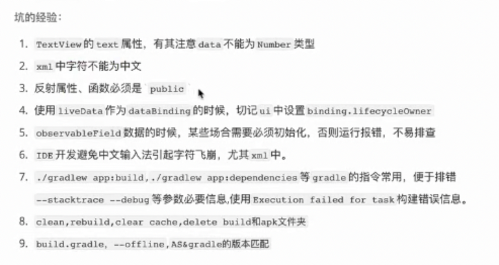
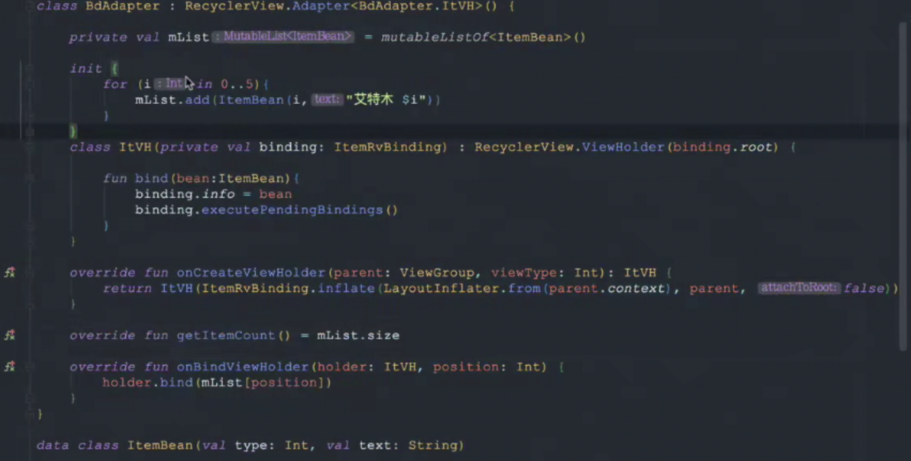

# Android jetpack(架构篇)
## 一、依赖汇总

<span id = "lwj_dep"/>

```kotlin
dependencies {
    def lifecycle_version = "2.3.1"
    def arch_version = "2.1.0"

    // ViewModel
    implementation "androidx.lifecycle:lifecycle-viewmodel-ktx:$lifecycle_version"
    // LiveData
    implementation "androidx.lifecycle:lifecycle-livedata-ktx:$lifecycle_version"
    // Lifecycles only (without ViewModel or LiveData)
    implementation "androidx.lifecycle:lifecycle-runtime-ktx:$lifecycle_version"

    // Saved state module for ViewModel
    implementation "androidx.lifecycle:lifecycle-viewmodel-savedstate:$lifecycle_version"

    // Jetpack Compose Integration for ViewModel
    implementation "androidx.lifecycle:lifecycle-viewmodel-compose:1.0.0-alpha04"

    // Annotation processor
    kapt "androidx.lifecycle:lifecycle-compiler:$lifecycle_version"
    // alternately - if using Java8, use the following instead of lifecycle-compiler
    implementation "androidx.lifecycle:lifecycle-common-java8:$lifecycle_version"

    // optional - helpers for implementing LifecycleOwner in a Service
    implementation "androidx.lifecycle:lifecycle-service:$lifecycle_version"

    // optional - ProcessLifecycleOwner provides a lifecycle for the whole application process
    implementation "androidx.lifecycle:lifecycle-process:$lifecycle_version"

    // optional - ReactiveStreams support for LiveData
    implementation "androidx.lifecycle:lifecycle-reactivestreams-ktx:$lifecycle_version"

    // optional - Test helpers for LiveData
    testImplementation "androidx.arch.core:core-testing:$arch_version"
}
```
## 二、Lifecycles
观察fragment/activity的生命周期
> Handling Lifecycles with Lifecycle-Aware Components  ｜Android Developers

### 1、Lifecycles的创建
#### 1.1、LifecycleObserver接口实现类的创建
> Handling Lifecycles with Lifecycle-Aware Components  ｜Android Developers
>
> > Lifecycle

```kotlin
class MyObserver : LifecycleObserver {

    @OnLifecycleEvent(Lifecycle.Event.ON_RESUME)
    fun connectListener() {
        ...
    }

    @OnLifecycleEvent(Lifecycle.Event.ON_PAUSE)
    fun disconnectListener() {
        ...
    }
}
```
### 2、对需要观察生命周期的活动进行绑定
src -> main -> com.lej.test -> NeedToObserverActivity.kt

```kotlin
class NeedToObserverActivity : AppCompatActivity() {
        override fun onCreate(...) {
        	myLifecycleOwner.getLifecycle().addObserver(MyObserver())
        }
}
```
### 3、Lifecycles的使用用途
一个活动新建的时候同时开启后台服务

### 4、Lifecycles的好处
* 解决了一致性问题(使用custom接口也可以解决)
* 解决了在生命周期里面编写代码的严重问题(代码入侵,接口也无法解决)
* 解决了内存泄露问题
	因为使用接口解决一致性问题的时候可能出现内存泄露  
	
	```java
	customInterfaceImpVariable.xxxAction(this);
	```


## 三、LiveData
专门用来实现对数据进行观察，从而数据发生改变的时候，布局里显示数据的控件视图也发生改变
### 1、LiveData的创建
#### 1.1、依赖的导入
<a href = "#lwj_dep">详情可参考</a>
#### 1.2、创建LiveData Object
> LiveData Overview ｜Android Developers
>
> > Create LiveData objects

ViewModel里创建LiveData Object

```kotlin
class NameViewModel : ViewModel() {

    // Create a LiveData with a String
    val currentName: MutableLiveData<String> by lazy {
        MutableLiveData<String>()
    }

    // Rest of the ViewModel...
}
```
#### 1.3、对数据进行观察和数据改变时布局的监听操作
> LiveData Overview ｜Android Developers
>
> > Observe LiveData objects

<span id = "lwj_update_view"/>

```kotlin
class NameActivity : AppCompatActivity() {

    // Use the 'by viewModels()' Kotlin property delegate
    // from the activity-ktx artifact
    private val model: NameViewModel by viewModels()

    override fun onCreate(savedInstanceState: Bundle?) {
        super.onCreate(savedInstanceState)

        // Other code to setup the activity...

        // Create the observer which updates the UI.
        val nameObserver = Observer<String> { newName ->
            // Update the UI, in this case, a TextView.
            nameTextView.text = newName
        }

        // Observe the LiveData, passing in this activity as the LifecycleOwner and the observer.
        model.currentName.observe(this, nameObserver)
    }
}
```
#### 1.4、更新被观察的数据
> LiveData Overview ｜Android Developers
>
> > Update LiveData objects

```kotlin
button.setOnClickListener {
    val anotherName = "John Doe"
    model.currentName.setValue(anotherName)
}
```
#### 1.5、LiveData的好处
与Lifecycle进行了关联，即LiveData也具备生命周期的感应，此时不会发生如onCreate方法里setContentView方法后立即finish活动崩溃的现象了（即不会发生一打开活动立马关掉崩溃的错误了）
#### 1.6、自定义LiveData

## 四、ViewModel
以注重生命周期的方式来管理界面相关的数据，(让数据具备感应生命周期的特性)

### 1、ViewModel的创建
#### 1.1、依赖的导入
<a href = "#lwj_dep">详情可参考</a>
#### 1.2、activity中的ViewModel
> ViewModel Overview ｜Android Developers
>
> > Implement a ViewModel

##### 1.2.1、创建ViewModel子类
名字创建的规则eg: MainActivity --> MainViewModel

```kotlin
class MyViewModel : ViewModel() {
	//存放要监听的数据
    private val users: MutableLiveData<List<User>> by lazy {
        MutableLiveData().also {
            loadUsers()
        }
    }

    fun getUsers(): LiveData<List<User>> {
        return users
    }

    private fun loadUsers() {
        // Do an asynchronous operation to fetch users.
    }
}
```
##### 1.2.2、活动中对数据进行观察

```kotlin
class MyActivity : AppCompatActivity() {

    override fun onCreate(savedInstanceState: Bundle?) {
        // Create a ViewModel the first time the system calls an activity's onCreate() method.
        // Re-created activities receive the same MyViewModel instance created by the first activity.

        // Use the 'by viewModels()' Kotlin property delegate
        // from the activity-ktx artifact
        //导包:implementation "androidx.fragment:fragment-ktx:1.2.5"//by viewModels()
        val model: MyViewModel by viewModels()
        //by 委托, viewModels()内部getValue()实现了返回ViewModel类的实现
        model.getUsers().observe(this, Observer<List<User>>{ users ->
            // update UI
        })
    }
}
```
#### 1.3、fragment中的ViewModel
#### 1.4、ViewModel的好处
ViewModel在生命周期重建的时候(如旋转屏幕)，数据不会丢失

## 五、ViewBinding
解决了需要findviewbyid的写法，将view和xml布局进行了绑定，可以直接通过拿到的id表示这个id所在的view控件
### 1、ViewBinding的创建
#### 1.1、环境的配置
> View Binding｜Android Developers
>
> >  Setup instructions <a href = "https://developer.android.google.cn/topic/libraries/view-binding#setup">详情</a>

app/library module下

```kotlin
android {
    ...
    buildFeatures {
        viewBinding true
    }
}
```
#### 1.2、activity中的使用
##### 1.2.1、root view的设置
> View Binding｜Android Developers
>
> >  Setup instructions

```xml
<LinearLayout
        ...
        tools:viewBindingIgnore="true" >
    ...
</LinearLayout>
```
##### 1.2.2、代码中的设置
> View Binding｜Android Developers
>
> >  Use view binding in activities

```kotlin
//lateinit延迟加载,变量只能为var若想为val需委托lazy加载(懒加载单例)
private lateinit var binding: ResultProfileBinding
//ResultProfileBinding命名规则: result_profile.xml -> ResultProfileBinding
//此时的ResultProfileBinding就等同于result_profile.xml

override fun onCreate(savedInstanceState: Bundle?) {
    super.onCreate(savedInstanceState)
    binding = ResultProfileBinding.inflate(layoutInflater)
    val view = binding.root
    setContentView(view)
}
```
监听里的赋值操作

```kotlin
binding.name.text = viewModel.name
binding.button.setOnClickListener { viewModel.userClicked() }
```
#### 1.3、fragment中的使用

##### 1.2.1、root view的设置
> View Binding｜Android Developers
>
> >  Setup instructions

```xml
<LinearLayout
        ...
        tools:viewBindingIgnore="true" >
    ...
</LinearLayout>
```
##### 1.2.2、代码中的设置
> View Binding｜Android Developers
>
> > Use view binding in fragments

```kotlin
private var _binding: ResultProfileBinding? = null
// This property is only valid between onCreateView and
// onDestroyView.
private val binding get() = _binding!!

override fun onCreateView(
    inflater: LayoutInflater,
    container: ViewGroup?,
    savedInstanceState: Bundle?
): View? {
    _binding = ResultProfileBinding.inflate(inflater, container, false)
    val view = binding.root
    return view
}

override fun onDestroyView() {
    _binding = null
}
```

### 3、ViewBinding好处
* 代替findViewById方法
* 取代butterknife
* 代替kotlin的synthetics

## 六、DataBinding
进行xml布局里控件数据与ViewModel的数据进行绑定, 这样ViewModel数据改变,布局也自动改变,即<a href = "#lwj_update_view">不用手动添加监听更新视图,只用观察即可</a>
### 1、DataBinding的创建
#### 1.1、构造环境
> Get started ｜Android Developers
>
> > Build environment

```kotlin
android {
    ...
    buildFeatures {
        dataBinding true
    }
}
```
#### 1.2、单向绑定
单向绑定指的是数据改变，页面布局改变
##### 1.2.1、布局中配置
> Data Binding Library ｜Android Developers
>
> > Using the Data Binding Library

```xml
<layout xmlns:android="http://schemas.android.com/apk/res/android"
        xmlns:app="http://schemas.android.com/apk/res-auto">
    <data>
        <variable
            name="viewmodel"
            type="com.myapp.data.ViewModel" />
    </data>
    <ConstraintLayout... >
     <!-- UI layout's root element -->
    	<CheckBox
		    android:id="@+id/rememberMeCheckBox"
		    android:checked="@{viewmodel.rememberMe}"
		    android:onCheckedChanged="@{viewmodel.rememberMeChanged}"
		/>			
    </ConstraintLayout>
</layout>
```
#### 1.3、双向绑定
比单向绑定多的是，当页面布局改变的时候，数据也会发生改变
##### 1.3.1、布局中绑定
> Data Binding Library ｜Android Developers
>
> > Using the Data Binding Library

```xml
<layout xmlns:android="http://schemas.android.com/apk/res/android"
        xmlns:app="http://schemas.android.com/apk/res-auto">
    <data>
        <variable
            name="viewmodel"
            type="com.myapp.data.ViewModel" />
    </data>
    <ConstraintLayout... >
     <!-- UI layout's root element -->
    	<CheckBox
		    android:id="@+id/rememberMeCheckBox"
		    android:checked="@{viewmodel.rememberMe}"
		    android:onCheckedChanged="@{viewmodel.rememberMeChanged}"
		/>			
    </ConstraintLayout>
</layout>
```

##### 1.3.2、适配器类中绑定适配器

> Data Binding Library ｜Android Developers
>> Using the Data Binding Library
此时要使用注解需要应用插件:  

```kotlin
apply plugin: 'koltin-kapt'
```

```kotlin
@BindingAdapter("app:goneUnless")
fun goneUnless(view: View, visible: Boolean) {
    view.visibility = if (visible) View.VISIBLE else View.GONE
}

```
##### 1.3.3、与数据绑定
###### 与JavaBean数据绑定
* 活动/碎片中绑定数据(JavaBean)
> Layouts and binding expressions ｜Android Developers
>
> > Binding data

```kotlin
override fun onCreate(savedInstanceState: Bundle?) {
    super.onCreate(savedInstanceState)

    val binding: ActivityMainBinding = DataBindingUtil.setContentView(
            this, R.layout.activity_main)

    binding.user = User("Test", "User")
}

```
###### 与ViewModel数据绑定
> Bind layout views to Architecture Components ｜Android Developers
>
> > Use ViewModel to manage UI-related data

```kotlin
class ViewModelActivity : AppCompatActivity() {
    override fun onCreate(savedInstanceState: Bundle?) {
        // Obtain the ViewModel component.
        val userModel: UserModel by viewModels()

        // Inflate view and obtain an instance of the binding class.
        val binding: UserBinding = DataBindingUtil.setContentView(this, R.layout.user)

        // Assign the component to a property in the binding class.
        binding.viewmodel = userModel
    }
}
```

### 2、可能用到的情况
#### 2.1、设置view的可见性
> Layouts and binding expressions
>
> > Imports

布局中导入

```xml
<data>
    <import type="android.view.View"/>
</data>
```
对布局中的需要控制可见性的某个控件进行设置

```xml
<TextView
   android:text="@{user.lastName}"
   android:layout_width="wrap_content"
   android:layout_height="wrap_content"
   android:visibility="@{user.isAdult ? View.VISIBLE : View.GONE}"/>
```


### 3、DataBinding踩过的坑



### 4、DataBinding高级用法
如下所示通过DataBinding定义加载图片的方法
#### 4.1、布局中的属性设置
> Binding adapters ｜Android Developers
>
> > Provide custom logic

```xml
<ImageView app:imageUrl="@{venue.imageUrl}" app:error="@{@drawable/venueError}" />
<!-- 
//注意这里的venue.imageUrl常用viewModel里的数据来替代
-->
```
#### 4.2、代码中的设置
> Binding adapters ｜Android Developers
>
> > Provide custom logic

```kotlin
//BindingAdapter让原有的View/ViewGroup不支持的属性变得支持
@BindingAdapter("imageUrl", "error")
fun loadImage(view: ImageView, url: String, error: Drawable) {
    Picasso.get().load(url).error(error).into(view)
}
```
### 5、DataBinding在RecyclerView中的使用
> Generated binding classes ｜Android Developers
>
> > Dynamic Variables

```kotlin
override fun onBindViewHolder(holder: BindingHolder, position: Int) {
    item: T = items.get(position)
    holder.binding.setVariable(BR.item, item);
    holder.binding.executePendingBindings();
    //必须要有的,让数据可以生效到RecyclerView上面
    //意思是：当数据改变时，binding会在下一帧去改变数据，如果我们需要立即改变，就去调用executePendingBindings方法。
}
```

* demo

## 七、Room