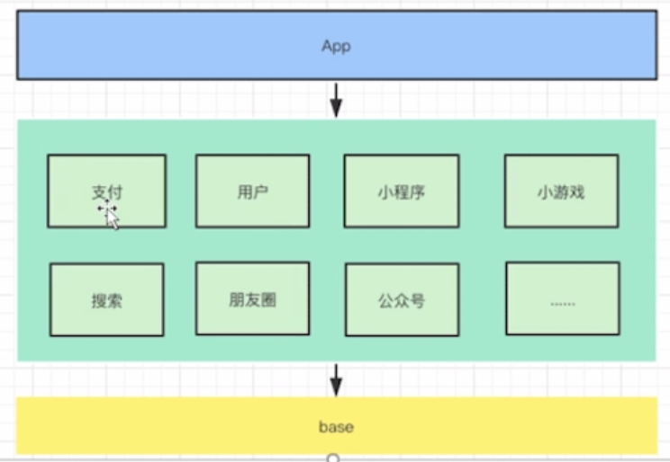
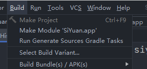
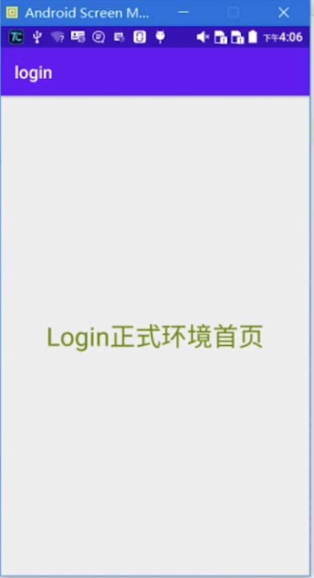
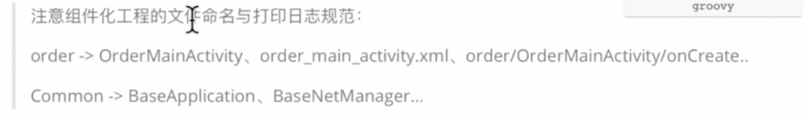
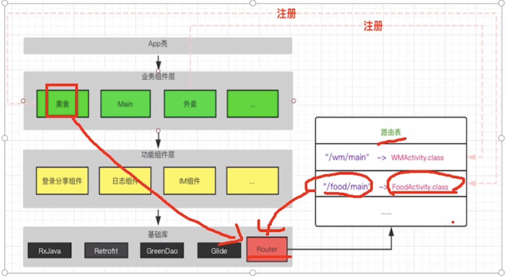
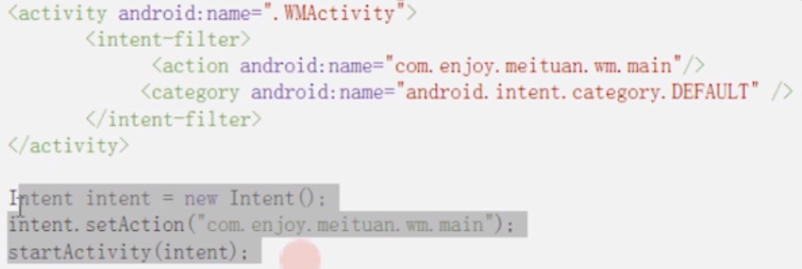
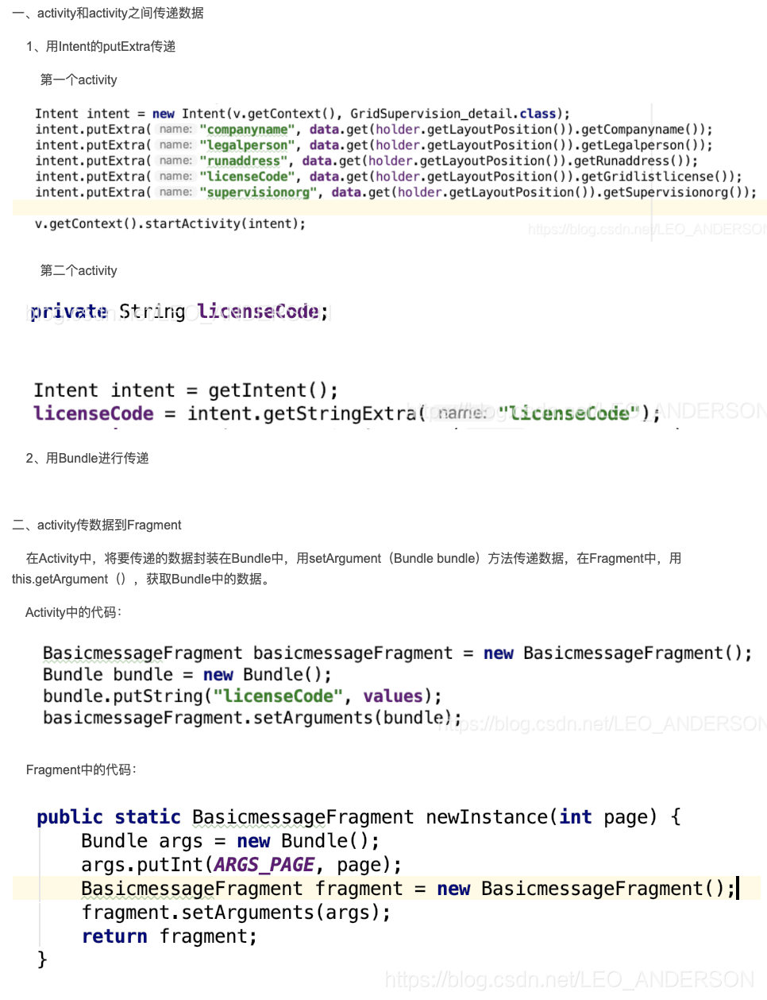
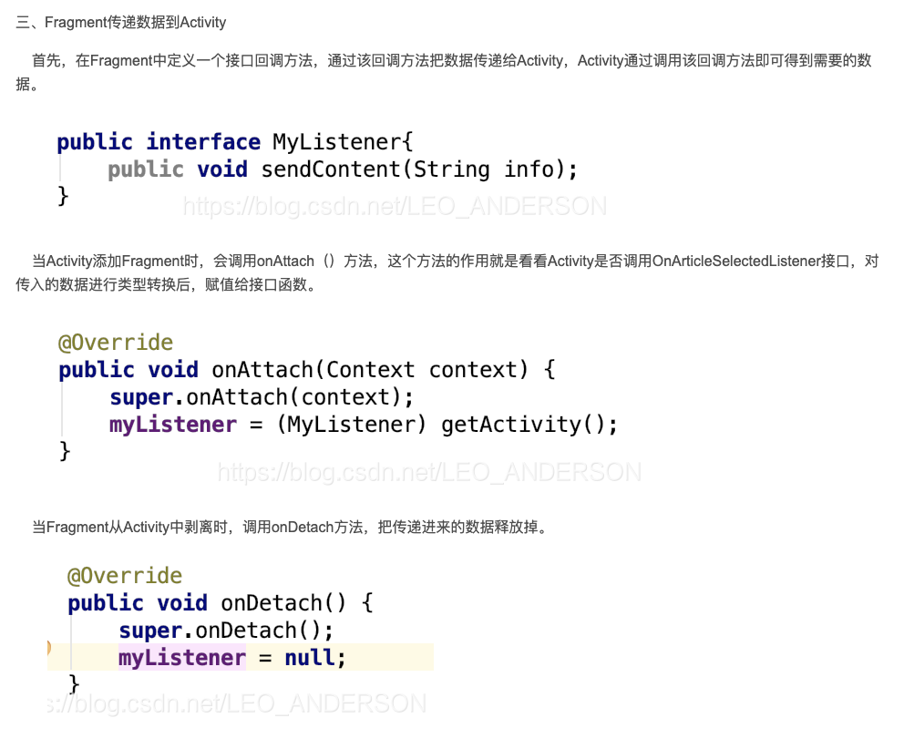
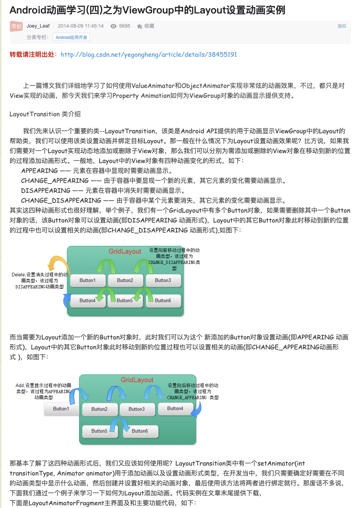
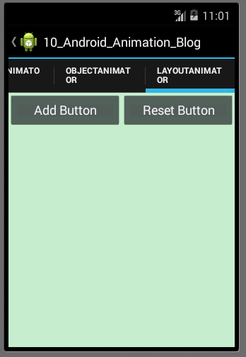

# 主题一: 「Android project nodes」

[TOC]
<span id = "lwj_锚点"> </span>
> 笔记前言: 基于kotlin和Java语言为基础阅读

##	 一、环境配置及git托管
### 1、添加依赖的翻墙问题
AndroidStudio 编译时出现如下问题 SSL peer shut down incorrectly 或者某些jar包下载不下来，一般是因为墙的原因导致的。这时候我们就需要配置镜像来解决这个问题。（为了提高jar包的下载速度也可以配置）配置的方法就是在根build.gradle中添加镜像仓库，一般我们选择阿里的 http://maven.aliyun.com/nexus/content/groups/public/完整的如下所示

```groovy
buildscript {

    repositories {
        google()
        maven { url 'http://maven.aliyun.com/nexus/content/groups/public/' }
        jcenter()
    }
    dependencies {
        classpath 'com.android.tools.build:gradle:3.2.1'
    }
}

allprojects {
    repositories {
        google()
        maven { url 'http://maven.aliyun.com/nexus/content/groups/public/' }
        jcenter()
    }
}

task clean(type: Delete) {
    delete rootProject.buildDir
}
```
### 2、Kotlin-Android-Extensions的使用和配置

* 在app/library Module -> build.gradle文件添加插件配置

```kotlin
apply plugin: 'kotlin-android-extensions'
```

* 在需要绑定视图的Activity、Fragment、Adapter及自定义View中引入资源文件

```koltin
import kotlinx.android.synthetic.main.activity_main.*
```

* 在使用的位置，直接使用xml中对应的id访问视图，完整代码如下：

```kotlin
import kotlinx.android.synthetic.main.activity_main.*

class MainActivity : AppCompatActivity() {

    override fun onCreate(savedInstanceState: Bundle?) {
        super.onCreate(savedInstanceState)
        setContentView(R.layout.activity_main)

        btn_login.setOnClickListener {
            Toast.makeText(this@MainActivity,"登录",Toast.LENGTH_SHORT).show()
        }
    }
}
```
### 3、Git托管
[参考git文档](git use.md)
##	 二、模块化组件化构造工程
> bilibili video 
>
> > 大型app是如何进行项目重构的

模块化层次示意图:
### 1、模块化的执行顺序
* setp 1: project/settings.gradle 目录(setp -> 1)
* setp 2: project/build.gradle(step -> 2)
* setp 3: app module/build.gradle(step -> 3)
* setp 4: library module/build.gradle(step -> 4)


### 2、模块化的目录
#### 2.1、project目录
##### project/build.gradle
#### 2.2、app module目录
##### 2.2.1、 build.gradle文件
###### 生成app包
```groovy
apply plugin: 'com.android.application'
//表示最终可以打出app包来
```
###### 给app依赖子模块

```groovy
dependencies{
	...
	implementation project(':p_appbrand')
	//表示依赖到 p_appbrand 子模块
	implementation project(':p_pay')
	implementation project(':p_account')
  	include ':app', ':p_pay'
}
```
#### 2.3、library module/中间模块 目录
每一个组件都有自己对应的API
#### 2.4、base module/底层模块 目录

<a href = "#lwj_common">详情请看common module</a>
#### 2.5、settings.gradle 目录(根gradle) 
运行后执行的第一步

```java
//注册一般工程
include ':app', ':p_pay'

//注册api module工程
include_with_api(':p_pay')//让p_pay module ".api"化


//自定义include_with_api脚本
def include_with_api(String modulename){
	...module
}

```

#### 2.6、module -> build.gradle目录

```kotlin
dependencies{
	...
	implementation project(':p_appbrand')
	//表示依赖到 p_appbrand 子模块
	implementation project(':p_pay')
	implementation project(':p_account')
  	include ':app', ':p_pay'
}
```
#### 2.7、app module通用配置（未创建common模块前）
##### 2.7.1、插件的配置
app/library module

```kotlin
plugins {
    id 'com.android.application'

}
apply plugin: 'kotlin-android'
//apply plugin: 'kotlin-android-extensions'
apply plugin: 'kotlin-parcelize'
//警告提示将kotlin-android-extensions改为kotlin-parcelize
//apply plugin: 'com.android.application'
apply plugin: 'kotlin-kapt'
//kotlin语言使用注入框架，databading都要用这个
apply plugin: "androidx.navigation.safeargs.kotlin"
//用于navigation传参的时候的一种保护,注意这个插件要配置依赖才可以使用
```

##### 2.7.2、共用依赖的配置
app module -> build.gradle

```kotlin
//region 一、android自带的依赖
    implementation "org.jetbrains.kotlin:kotlin-stdlib:$kotlin_version"
    // 1、kotlin语言依赖
    implementation 'androidx.core:core-ktx:1.2.0'
    implementation 'androidx.appcompat:appcompat:1.1.0'
    implementation 'com.google.android.material:material:1.1.0'
    implementation 'androidx.constraintlayout:constraintlayout:1.1.3'
    testImplementation 'junit:junit:4.+'
    androidTestImplementation 'androidx.test.ext:junit:1.1.1'
    androidTestImplementation 'androidx.test.espresso:espresso-core:3.2.0'
    //endregion


    //region 二、kotlin协程 最新版本可github上搜索kotlinx.coroutines -> Releases
    implementation 'org.jetbrains.kotlinx:kotlinx-coroutines-core:1.5.0-RC'
    // 1、java环境下
    implementation 'org.jetbrains.kotlinx:kotlinx-coroutines-android:1.5.0-RC'
    // 2、Android环境下
    //endregion
```


##### 2.7.3、路径配置

project module  -> build.gradle

```kotlin
 dependencies {
	//region navigation插件对应依赖配置
	        //为了能使用navigation插件 eg: android闭包下的databinding enabled属性设为true
	        def nav_version = "2.3.5"
	        //include classpath
	        classpath "androidx.navigation:navigation-safe-args-gradle-plugin:$nav_version"
	        //endregion
}
```
##### 2.7.3、其他配置
* dataBinding的配置
app/library module

```kotlin
android{
	...
	dataBinding{
		enabled true
	}
}
```
##### 2.7.4、app module 模块demo

```kotlin
plugins {
    id 'com.android.application'

}
apply plugin: 'kotlin-android'
//apply plugin: 'kotlin-android-extensions'
apply plugin: 'kotlin-parcelize'
apply plugin: 'com.android.application'
apply plugin: 'kotlin-kapt'
//kotlin语言使用注入框架，databading都要用这个
apply plugin: "androidx.navigation.safeargs.kotlin"
//用于navigation传参的时候的一种保护,注意这个插件要配置依赖才可以使用

android {
    compileSdkVersion 30
    buildToolsVersion "30.0.3"

    defaultConfig {
        applicationId "com.lwj.lwj_demo"
        minSdkVersion 16
        targetSdkVersion 30
        versionCode 1
        versionName "1.0"

        testInstrumentationRunner "androidx.test.runner.AndroidJUnitRunner"
    }

    buildTypes {
        release {
            minifyEnabled false
            proguardFiles getDefaultProguardFile('proguard-android-optimize.txt'), 'proguard-rules.pro'
        }
    }
    compileOptions {
        sourceCompatibility JavaVersion.VERSION_1_8
        targetCompatibility JavaVersion.VERSION_1_8
    }
    kotlinOptions {
        jvmTarget = '1.8'
    }
    dataBinding{
        enabled true
    }
}

dependencies {

    //region 一、android自带的依赖
    implementation "org.jetbrains.kotlin:kotlin-stdlib:$kotlin_version"
    // 1、kotlin语言依赖
    implementation 'androidx.core:core-ktx:1.2.0'
    implementation 'androidx.appcompat:appcompat:1.1.0'
    implementation 'com.google.android.material:material:1.1.0'
    implementation 'androidx.constraintlayout:constraintlayout:1.1.3'
    testImplementation 'junit:junit:4.+'
    androidTestImplementation 'androidx.test.ext:junit:1.1.1'
    androidTestImplementation 'androidx.test.espresso:espresso-core:3.2.0'
    //endregion


    //region 二、kotlin协程 最新版本可github上搜索kotlinx.coroutines -> Releases
    implementation 'org.jetbrains.kotlinx:kotlinx-coroutines-core:1.5.0-RC'
    // 1、java环境下
    implementation 'org.jetbrains.kotlinx:kotlinx-coroutines-android:1.5.0-RC'
    // 2、Android环境下
    //endregion


    //region 四、


}
​```F
### 3、模块化的配置
> bilibili video
>
> >  Android项目Module管理与部署/Arouter

#### 3.1、app module/build.gradle删除相同属性值及抽取依赖

​```kotlin

android {
//  compileSdkVersion 30
    compileSdkVersion 
//下面同理
    buildToolsVersion 

    defaultConfig {
        applicationId "com.example.mytest"
        minSdkVersion 
        targetSdkVersion 
        versionCode 
        versionName 

        testInstrumentationRunner "androidx.test.runner.AndroidJUnitRunner"
    }

    buildTypes {
        release {
            minifyEnabled false
            proguardFiles getDefaultProguardFile('proguard-android-optimize.txt'), 'proguard-rules.pro'
        }
    }
    compileOptions {
        sourceCompatibility JavaVersion.VERSION_1_8
        targetCompatibility JavaVersion.VERSION_1_8
    }
    kotlinOptions {
        jvmTarget = '1.8'
    }
}
dependencies {
/* 抽取所有共同依赖性
//    fragmenty依赖
    def fragment_version = "1.3.2"
    // Java language implementation
    implementation "androidx.fragment:fragment:$fragment_version"
    // Kotlin
    implementation "androidx.fragment:fragment-ktx:$fragment_version"
//    -------------------------------
    //recycleview的分割线
    implementation 'com.github.fondesa:recycler-view-divider:3.5.0'
    //recycleview控件的依赖
    implementation "androidx.recyclerview:recyclerview:1.1.0"
    // For control over item selection of both touch and mouse driven selection
    implementation "androidx.recyclerview:recyclerview-selection:1.1.0"
//    ---------------------------------

    implementation "org.jetbrains.kotlin:kotlin-stdlib:$kotlin_version"
    implementation 'androidx.core:core-ktx:1.2.0'
    implementation 'androidx.appcompat:appcompat:1.1.0'
    implementation 'com.google.android.material:material:1.1.0'
    implementation 'androidx.constraintlayout:constraintlayout:1.1.3'
    testImplementation 'junit:junit:4.+'
    androidTestImplementation 'androidx.test.ext:junit:1.1.1'
    androidTestImplementation 'androidx.test.espresso:espresso-core:3.2.0'
*/
} 
```
#### 3.2、library module/build.gradle删除相同属性值及抽取依赖

```kotlin

android {
//  compileSdkVersion 30
    compileSdkVersion 
//下面同理
    buildToolsVersion 

    defaultConfig {
        applicationId "com.example.mytest"
        minSdkVersion 
        targetSdkVersion 
        versionCode 
        versionName 

        testInstrumentationRunner "androidx.test.runner.AndroidJUnitRunner"
    }

    buildTypes {
        release {
            minifyEnabled false
            proguardFiles getDefaultProguardFile('proguard-android-optimize.txt'), 'proguard-rules.pro'
        }
    }
    compileOptions {
        sourceCompatibility JavaVersion.VERSION_1_8
        targetCompatibility JavaVersion.VERSION_1_8
    }
    kotlinOptions {
        jvmTarget = '1.8'
    }
}
dependencies {
/* 抽取所有共同依赖性
//    fragmenty依赖
    def fragment_version = "1.3.2"
    // Java language implementation
    implementation "androidx.fragment:fragment:$fragment_version"
    // Kotlin
    implementation "androidx.fragment:fragment-ktx:$fragment_version"
//    -------------------------------
    //recycleview的分割线
    implementation 'com.github.fondesa:recycler-view-divider:3.5.0'
    //recycleview控件的依赖
    implementation "androidx.recyclerview:recyclerview:1.1.0"
    // For control over item selection of both touch and mouse driven selection
    implementation "androidx.recyclerview:recyclerview-selection:1.1.0"
//    ---------------------------------

    implementation "org.jetbrains.kotlin:kotlin-stdlib:$kotlin_version"
    implementation 'androidx.core:core-ktx:1.2.0'
    implementation 'androidx.appcompat:appcompat:1.1.0'
    implementation 'com.google.android.material:material:1.1.0'
    implementation 'androidx.constraintlayout:constraintlayout:1.1.3'
    testImplementation 'junit:junit:4.+'
    androidTestImplementation 'androidx.test.ext:junit:1.1.1'
    androidTestImplementation 'androidx.test.espresso:espresso-core:3.2.0'
*/
} 
```
#### 3.3、新建共用的build.gradle文件
project(工程)目录 -> new File -> basic.gradle  
好处: 通过修改共用gradle文件，从而修改所有的模块gradle文件

```java
//ext{} : 扩展块
ext {
		//大纲3.7
    isRelease = false //false:产品测试期间，未上线作为Lib组件存在， true:产品正式上线，作为application存在
    
   //大纲3.9
	 url = [
	 //测试期间服务器地址
	 	"debug" : "https://192.188.22.99/debug",
	 //正式发布及运行期间服务器地址
	 	"release" : "https://192.188.22.99/release"
	 ]
	
    signingConfig = [
            signFile     : '../app/moduledemo.jks',
            storePassword: '123456',
            keyAlias     : 'moduledemo',
            keyPassword  : '123456'
    ]

    //大纲4.0.2
    androidId = [
            applicationId    : "com.lwx.moduledemo",
            moduleAppId_news : "com.lwx.module_news",
            moduleAppId_login: "com.lwx.module_login",

            compileSdkVersion: 26,
            buildToolsVersion: '26.0.3',
            minSdkVersion    : 15,
            targetSdkVersion : 26,
            versionName      : '1.0.0',
            versionCode      : 100
    ]

    deps = [
            supportv4                   : 'com.android.support:support-v4:26.1.0',
            appcompatv7                 : 'com.android.support:appcompat-v7:26.1.0',
            constraintlayout            : 'com.android.support.constraint:constraint-layout:1.1.3',
            design                      : 'com.android.support:design:26.1.0',
            //阿里Arouter
            arouterapi                  : 'com.alibaba:arouter-api:1.5.0',
            aroutercompiler             : 'com.alibaba:arouter-compiler:1.2.2',

            // ------------- Test dependencies -------------
            junit                       : 'junit:junit:4.12',
            testrunner                  : 'com.android.support.test:runner:1.0.2',
            testespresso                : 'com.android.support.test.espresso:espresso-core:3.0.2',
    ]
}

```
#### 3.4、project module/build.gradle引入basic.gradle

```java
//根目录下的build.gradle引入
apply from : '../basic.gradle'
  //../表示上一级下的
...
```
#### 3.5、在所有的module中引入共用module下的androidId的值和遍历deps
包括app module

```java
android {
//  compileSdkVersion 30 androidId. compileSdkVersion
    compileSdkVersion androidId.compileSdkVersion
//下面同理
    buildToolsVersion androidId.buildToolsVersion

    defaultConfig {
        applicationId "com.example.mytest"
        minSdkVersion androidId.minSdkVersion
        targetSdkVersion androidId.targetSdkVersion
        versionCode androidId.versionCode
        versionName androidId.versionName

        testInstrumentationRunner "androidx.test.runner.AndroidJUnitRunner"
    }
    ...
}
dependencies {
  //测试是否成功引入文件
  deps.each{k,v -> println("k is:" + k + "\nv is:" + v + "\n")}
  
  deps.each{k,v -> implementation v}
}
```
#### 3.6、共用module模块中ext设置debug和release
设置所有module的存在方式，若为测试期间，以library组件存在，若产品正式上线，以application存在

```java
ext{
	isRelease = false //false:产品测试期间，未上线作为Lib组件存在， true:产品正式上线，作为application存在
	...
}
```
#### 3.7、共用module模块中某个属性暴露到java中使用
app module -> build.gradle

```java
android{
	...
	defaultConfig {
	...
	//给Java组件暴露，标记，正式环境 和 测试环境的标记
	//组件化 和 集成化的时候需要
	//会加载到java BuildConfig类中作为静态常量isModule
        buildConfigField("boolean", "isRelease", String.valueOf(isRelease))
        //@param boolean: 定义暴露的属性的类型
        //@param isMoudle: 表示暴露给Java的属性的变量名
    }
    ...
}
```
#### 3.8、Java中使用被暴露的属性
Java类里的方法里面

```java
if(BuildConfig.isRelease == false){
	...
}else{

}
```
#### 3.8.1、BuildConfig找不到的问题
解决方法很简单，Build--Make Moudule XXX，重新编译并且解决存在的问题即可。  
 
#### 3.9、案例拿到正式和测试的服务器地址
##### 3.9.1、共用module模块中ext设置
设置测试和正式版本的服务器地址

```java
ext{
	url[
     //测试期间服务器地址
        "debug" : "https://192.188.22.99/debug",
     //正式发布及运行期间服务器地址
        "release" : "https://192.188.22.99/release"
     ]
	...
}
```
##### 3.9.2、共用module模块中某个属性暴露到java中使用
app module -> build.gradle

```java
android{
	...
	buildTypes {
	
	debug{
	//暴露给Java用
		buildConfigField("String", "debug", "\" ${url.debug} \"")
	}
	release{
	//暴露给Java用
		buildConfigField("String", "release", "\" ${url.release} \"")
		...
	}
	
    }
    ...
}
```
##### 3.9.3、Java中使用被暴露的属性
Java类里的方法里面

```java
String debug = BuildConfig.debug;
String release = BuildConfig.release;
```
#### 4.0、设置app module的独立运行条件
##### 4.0.1、app module的独立运行条件1
app module -> build.gradle

```java
apply plugin: 'com.android.application'
```
##### 4.0.2、app module的独立运行条件2
app module -> build.gradle

```java
android{
	...
	defaultConfig{
		applicationId "com.example.mytest"
	}
}
```
#### 4.1、设置library module的不可独立运行条件

##### 4.1.1、library module的不可独立运行条件1
libary module -> build.gradle

```java
if(isRelease){
	apply plugin: 'com.android.library'
	//不能独立运行
}else{
	apply plugin: 'com.android.application'
	//能独立运行
}
```
此外:需要修改library module -> build.gradle 文件中的默认代码，如下所示:

```java
/*
plugins {
    id 'com.android.application'
    id 'kotlin-android'
}
//删除上述代码块
*/

//更改为:
apply plugin: 'kotlin-android'
```
##### 4.1.2、library module的不可独立运行条件2
###### · build.gradle文件的改动
libary module -> build.gradle

```java
android{
	...
	/*
	//之前的写法
	defaultConfig{
	
		applicationId "com.example.mytest"
	}
	*/
	
	//改动后的写法
	
	defaultConfig{
		//如果是集成化模式不能有applicationId
    	if(!isRelease){
    		//组件化模式能独立运行才能有applicationId
			applicationId androidId.moduleApp_mylibrary
		}
	}
	...
	
}

```
###### · 共用的build.gradle文件的改动

```java
//ext{} : 扩展块
ext {
	...
	//大纲3.7
    isRelease = true //false:产品测试期间，未上线作为Lib组件存在， true:产品正式上线，作为application存在

    //大纲4.0.2
    android = [
            applicationId    : "com.lwx.moduledemo",
            moduleAppId_news : "com.lwj.module_news",
            moduleAppId_login: "com.lwj.module_login",

            compileSdkVersion: 26,
            buildToolsVersion: '26.0.3',
            minSdkVersion    : 15,
            targetSdkVersion : 26,
            versionName      : '1.0.0',
            versionCode      : 100
    ]
}
```
#### 4.2、各module间依附的设置
##### 4.2.1、library module依附到app壳的设置
当isRelease为true(即项目要上线)的时候设置library依附app壳  
app module的build.gradle的设置

```java
dependencies{
//当产品要release的时候
	if(isRelease){
		//所有子模块要依附app壳，只能打包出一个app壳包
		implementation project(':login')
		implementation project(':register')
		//这里可以使用一个foreach搞定所有
		//上网搜foreach子模块依附app壳
	}
}
```
##### 4.2.2、common module依附到各个library module的设置
library module的build.gradle的设置

```kotlin
dependencies{
	implementation project(':common')
    
}
```
#### 4.3、library module作为独立运行的模块时清单文件的设置
##### 4.3.1、不进行设置出现的问题
默认界面如下:  
  
出现的问题: 展示的是正式环境首页而不是测试环境首页

##### 4.3.2、自动控制AndroidManifest.xml文件生效和失效

* 创建debug时AndroidManifest.xml文件（测试和正式版本时使用的清单文件） 

library moudle -> src -> debug(you create) -> AndroidManifest.xml(you create)

* 创建debug时loginDebugActivity文件（测试和正式版本时使用的登陆类）  

library moudle -> src -> java -> com.lwj.example -> debug(you create) -> LoginDebugActivity.java(you create)

* 动态的设置测试和正式时候的文件的生效
library module -> build.gradle

```java
android{
	...
	sourceSets{
		main{
			if(!isRelease){
				manifest.srcFile 'src/main/debug/AndroidManifest.xml'
			}else{
				manifest.srcFile 'src/main/AndroidManifest.xml'
				java{
					//release时debug目录下文件不需要合并到主工程
					exclude '**/debug/**' 
					//屏蔽debug里面的所有文件不打包apk, 这样正式环境下测试代码无法进入apk，以达到apk的瘦身
					
				}
			}
		}
	}
}
```
##### 集成化测试时AndroidManifest.xml的创建
isRelease = false

res -> library module(eg: splash) -> src -> main -> debug(you create) -> AndroidManifest.xml(you create)

```xml
<?xml version="1.0" encoding="utf-8"?>
<manifest xmlns:android="http://schemas.android.com/apk/res/android"
    package="com.lwj.splash">
    <application>
        <activity android:name=".MainActivity"/>
    </application>

</manifest>
```
#### 4.4、模块化demo
##### 4.4.1、app module -> build.gradle

```kotlin
plugins {
    id 'com.android.application'

}
apply from:'../basic.gradle'
apply plugin: 'kotlin-android'
//apply plugin: 'kotlin-android-extensions'
apply plugin: 'kotlin-parcelize'

apply plugin: 'kotlin-kapt'
//kotlin语言使用注入框架，databading都要用这个
apply plugin: "androidx.navigation.safeargs.kotlin"
//用于navigation传参的时候的一种保护,注意这个插件要配置依赖才可以使用

android {
    compileSdkVersion androidId.compileSdkVersion
    println("test - androidId.compileSdkVersion value:" + androidId.compileSdkVersion)
    buildToolsVersion androidId.buildToolsVersion

    defaultConfig {
        applicationId androidId.applicationId
        minSdkVersion androidId.minSdkVersion
        targetSdkVersion androidId.targetSdkVersion
        versionCode androidId.versionCode
        versionName androidId.versionName
        //给Java组件暴露，标记，正式环境 和 测试环境的标记
        //组件化 和 集成化的时候需要
        //会加载到java BuildConfig类中作为静态常量isModule
        buildConfigField("boolean", "isRelease", String.valueOf(isRelease))
        //@param boolean: 定义暴露的属性的类型
        //@param isMoudle: 表示暴露给Java的属性的变量名


    }

    buildTypes {
        release {
            minifyEnabled false
            proguardFiles getDefaultProguardFile('proguard-android-optimize.txt'), 'proguard-rules.pro'
        }
    }
    compileOptions {
        sourceCompatibility JavaVersion.VERSION_1_8
        targetCompatibility JavaVersion.VERSION_1_8
    }
    kotlinOptions {
        jvmTarget = '1.8'
    }
    dataBinding{
        enabled true
    }
}

dependencies {
    deps.each{k,v -> implementation v}

    //当产品要release的时候
    if(isRelease){
        //所有子模块要依附app壳，只能打包出一个app壳包
        //implementation project(':splash')

        attachs.each{k,v -> implementation project(v)}
        //这里可以使用一个foreach搞定所有
        //上网搜foreach子模块依附app壳
    }
}
```
##### 4.4.2、library module -> build.gradle
###### common module

```kotlin
apply from: '../basic.gradle'

apply plugin: 'com.android.library'
//不能独立运行

apply plugin: 'kotlin-android'
//apply plugin: 'kotlin-android-extensions'
apply plugin: 'kotlin-parcelize'

apply plugin: 'kotlin-kapt'
//kotlin语言使用注入框架，databading都要用这个
apply plugin: "androidx.navigation.safeargs.kotlin"
//用于navigation传参的时候的一种保护,注意这个插件要配置依赖才可以使用
apply plugin: 'kotlin-android'
android {
    compileSdkVersion androidId.compileSdkVersion
    buildToolsVersion androidId.buildToolsVersion

    defaultConfig {
        minSdkVersion androidId.minSdkVersion
        targetSdkVersion androidId.targetSdkVersion
        versionCode androidId.versionCode
        versionName androidId.versionName

        testInstrumentationRunner androidId.testInstrumentationRunner
        consumerProguardFiles androidId.consumerProguardFiles
    }
    dataBinding{
        enabled true
    }

    buildTypes {
        release {
            minifyEnabled false
            proguardFiles getDefaultProguardFile('proguard-android-optimize.txt'), 'proguard-rules.pro'
        }
    }
  
  	sourceSets{
        main{
            if(!isRelease){
                manifest.srcFile 'src/main/debug/AndroidManifest.xml'
            }else{
                manifest.srcFile 'src/main/AndroidManifest.xml'
                java{
                    //release时debug目录下文件不需要合并到主工程
                    exclude '**/debug/**'
                    //屏蔽debug里面的所有文件不打包apk, 这样正式环境下测试代码无法进入apk，以达到apk的瘦身

                }
            }
        }
    }
  
    compileOptions {
        sourceCompatibility JavaVersion.VERSION_1_8
        targetCompatibility JavaVersion.VERSION_1_8
    }
    kotlinOptions {
        jvmTarget = '1.8'
    }
}

dependencies {
    depsCommon.each{k,v -> println("k is:" + k + "\nv is:" + v + "\n")}
    depsCommon.each{k,v -> implementation v}

    //okhttp
    //okhttp logging-interceptor

    //gson

    //retrofit
    //retrofit converter-gson

    //utilcodex
}


```
###### login module(常规业务module)

```kotlin
apply from: '../basic.gradle'

if(isRelease){
    apply plugin: 'com.android.library'
    //不能独立运行
}else{
    apply plugin: 'com.android.application'
    //能独立运行
}
apply plugin: 'kotlin-android'
android {
    compileSdkVersion androidId.compileSdkVersion
    buildToolsVersion androidId.buildToolsVersion

    defaultConfig {
        minSdkVersion androidId.minSdkVersion
        targetSdkVersion androidId.targetSdkVersion
        versionCode androidId.versionCode
        versionName androidId.versionName

        //如果是集成化模式不能有applicationId
        if(!isRelease) {
            //组件化模式能独立运行才能有applicationId
            applicationId androidId.moduleAppId_splash
            println("test - androidId.moduleAppId_splash" + androidId.moduleAppId_splash)
        }
        testInstrumentationRunner "androidx.test.runner.AndroidJUnitRunner"
        consumerProguardFiles "consumer-rules.pro"
    }

    buildTypes {
        release {
            minifyEnabled false
            proguardFiles getDefaultProguardFile('proguard-android-optimize.txt'), 'proguard-rules.pro'
        }
    }
    compileOptions {
        sourceCompatibility JavaVersion.VERSION_1_8
        targetCompatibility JavaVersion.VERSION_1_8
    }
    kotlinOptions {
        jvmTarget = '1.8'
    }
}

dependencies {
    implementation project(attachs.common)
    depsSplash.each{k,v -> implementation v}

}
```


##### 4.4.3、project -> basic.gradle(you create)

```kotlin
//ext{} : 扩展块
ext {
    //大纲3.7
    isRelease = false //false:产品测试期间，未上线作为Lib组件存在， true:产品正式上线，作为application存在

    /*
    url = [
            //测试期间服务器地址
            "debug" : "https://192.188.22.99/debug",
            //正式发布及运行期间服务器地址
            "release" : "https://192.188.22.99/release"
    ]

     */

    signingConfig = [
            signFile     : '../app/moduledemo.jks',
            storePassword: '123456',
            keyAlias     : 'moduledemo',
            keyPassword  : '123456'
    ]

    //大纲4.0.2
    androidId = [
            applicationId    : "com.lwx.lwj_demo",
            moduleAppId_splash : "com.lwx.module_spalsh",
            moduleAppId_login: "com.lwx.module_login",

            compileSdkVersion: 30,
            buildToolsVersion: '30.0.3',
            minSdkVersion    : 16,
            targetSdkVersion : 30,
            versionName      : '1.0',
            versionCode      : 1,

            testInstrumentationRunner :"androidx.test.runner.AndroidJUnitRunner",
            consumerProguardFiles :"consumer-rules.pro"
    ]


    //region
    depsCommon = [
            //region 一、android自带的依赖
            kotlin: "org.jetbrains.kotlin:kotlin-stdlib:$kotlin_version",
            // 1、kotlin语言依赖
            core: 'androidx.core:core-ktx:1.2.0',
            appcompatx: 'androidx.appcompat:appcompat:1.1.0',
            material: 'com.google.android.material:material:1.1.0',
            constraintlayout: 'androidx.constraintlayout:constraintlayout:1.1.3',
            junit: 'junit:junit:4.+',
            testjunit: 'androidx.test.ext:junit:1.1.1',
            testespresso: 'androidx.test.espresso:espresso-core:3.2.0'
            //endregion

            //region 二、kotlin协程 最新版本可github上搜索kotlinx.coroutines -> Releases

            //endregion
    ]
    //endregion

    depsSplash = [

    ]

    attachs = [
            splash: ":splash",
            common: ":common",
            service: "service"
    ]
}


```
##### 4.4.4、project -> build.gradle

```koitlin
// Top-level build file where you can add configuration options common to all sub-projects/modules.
buildscript {
    ext.kotlin_version = "1.3.72"
    repositories {
        google()
        jcenter()
    }
    dependencies {
        classpath "com.android.tools.build:gradle:4.1.2"
        classpath "org.jetbrains.kotlin:kotlin-gradle-plugin:$kotlin_version"

        // NOTE: Do not place your application dependencies here; they belong
        // in the individual module build.gradle files


        //region navigation插件对应依赖配置
        //为了能使用navigation插件 eg: android闭包下的databinding enabled属性设为true
        def nav_version = "2.3.5"
        //include classpath
        classpath "androidx.navigation:navigation-safe-args-gradle-plugin:$nav_version"
        //endregion


    }
}

allprojects {
    repositories {
        google()
        jcenter()
    }
}

task clean(type: Delete) {
    delete rootProject.buildDir
}
```

### 4、各个模块的配置
根据业务来讲common和service都是只作为module而不作为application运行的,只有常规业务模块也可以独立运行

<span id = "lwj_common"/>
#### 4.1、common模块(基础功能模块)

注意:创建方式是 project -> 右键 new module -> Android Library

##### 4.1.1、common模块文件及log的命名
如图:  

##### 4.1.2、BaseApplication
<a href = "#lwj_BaseApplication">查看详情</a>
##### 4.1.3、BaseActivity/ActivityKtx
<a href = "#lwj_ BaseActivity">查看详情</a>
##### 4.1.4、BaseFragment
<a href = "#lwj_ BaseFragment">查看详情</a>

#### 4.2、service模块(基础业务模块)
#### 4.3、login模块(常规业务模块)

注意:创建方式是 project -> 右键 new module -> Phone & Tablet Module


### 5、模块间通信方式

> bilibili video 
>
> >  大型app是如何进行项目重构的 25.30'  

---
> bilibili video 
>
> >  Android项目Module管理和部署/Arouter

* 禁止在一个library模块中通过implement project方式依赖其他模块，从而使得能够使用其他模块  --> 为了解耦

#### 5.1、EventBus
* 操作复杂很混乱且操作中需要new一个匿名内部类容易导致内存泄漏

#### 5.2、路由框架(ARouter)


##### 5.2.1	ARouter原理(java SPI机制)和流程
使用Java SPI机制(可以用来启用框架和扩展框架和替换组件)



* 将library module注册到ARouter中
*  拿到ARouter寻址（library module的地址）


###### SPI官网
> https://www.baeldung.com/java-spi

###### SPI好处
插拔机制:	想依赖就可以马上依赖想停止依赖就可以马上停止依赖
###### SPI配置步骤
> bilibili video
>
> > 多模块工程项目的通信演变

* base module -> src -> main -> java -> com.namexx.basenamexxx -> 创建一个接口(eg: TestSerivice)
* library module2 ->  src -> main -> java -> com.namexx.librarynamexxx -> 创建一个接口实现类(eg: TestSeriviceImpl)
* library module2 ->  src -> main -> resource(you create) -> META.INF.services (you create) ->  创建一个文件[eg: com.namexx.basenamexxx.TestService(创建的接口名)]
* [see more](https://www.baeldung.com/java-spi)

######、SPI使用步骤
* library module1(需要使用library module2模块内容的module) -> src -> main -> java -> com.namexx.librarynamexxx -> xxx.java(要进行通信的类) -> 某个需要调用的方法里面

```java
ServiceLoader<TestSerivice> serviceLoader = ServiceLoader.load(TestSerivice.class);
        Iterator<ITest> iTests = serviceLoader.iterator();
        while (iTests.hasNext()) {
            ITest iTest = iTests.next();
            System.out.printf("loading %s\n", iTest.getClass().getName());
            iTest.doingSomething();//Android里面可以在这里传入参数上下文
        }
```

##### 5.2.2、ARouter的配置(基于java语言)
> 官网: https://github.com/alibaba/ARouter  
> 博客: https://www.jianshu.com/p/6021f3f61fa6

###### 添加依赖

app/library  module 

```java
android {
    defaultConfig {
        ...
        javaCompileOptions {
            annotationProcessorOptions {
                arguments = [AROUTER_MODULE_NAME: project.getName()]
            }
        }
    }
}

dependencies {
    // Replace with the latest version
    compile 'com.alibaba:arouter-api:?'
    annotationProcessor 'com.alibaba:arouter-compiler:?'
    ...
}
// Old version of gradle plugin (< 2.2), You can use apt plugin, look at 'Other#1'
// Kotlin configuration reference 'Other#2'
```

##### 5.2.3、ARouter的配置(基于kotlin)

common module -> build.gradle

```kotlin
// You can refer to the wording in the "module-kotlin" module
apply plugin: 'kotlin-kapt'

kapt {
//注意与Android闭包位于同样的顶层位置，而不是Android闭包下
	arguments {
	    arg("AROUTER_MODULE_NAME", project.getName())
	 }
}


dependencies {
    compile 'com.alibaba:arouter-api:x.x.x'
    kapt 'com.alibaba:arouter-compiler:x.x.x'
    ...
}
```


##### 5.2.4、ARouter的好处
###### 组件间跳转
原生跳转

* 是直接的类依赖，耦合严重
* 原生隐式跳转通过AndroidManifest集中管理，协作开发困难
* 原生需要在AndroidManifest中注册，扩展性差
* 原生只要调用了startActivity就交由Android系统控制，过程无法干预，失败无法降级


路由跳转：

* 路由通过URL索引，无需依赖
* 路由通过分布式管理页面配置
* 路由使用注解来注册，方便扩展
* 路由使用AOP切面编程可以进行控制跳转的过滤，有灵活的降级方式

##### 5.2.5、ARouter的使用前初始化

```java
public class MyApplication extends Application {

    @Override
    public void onCreate() {
        super.onCreate();

        ARouter.openLog();     // 打印日志
        ARouter.openDebug();   // 开启调试模式(如果在InstantRun模式下运行，必须开启调试模式！线上版本需要关闭,否则有安全风险)
        ARouter.init( this ); // 尽可能早，推荐在Application中初始化
    }
}
```
##### 5.2.6、ARouter的使用场景

###### 不同实现不同模块中atv与fragment跳转
* 原生隐式跳转实现



* ARouter跳转

> 官网 -> Advanced usage -> Jump via URL

```java
// Create a new Activity for monitoring Scheme events, and then directly pass url to ARouter
public class SchemeFilterActivity extends Activity {
    @Override
    protected void onCreate(Bundle savedInstanceState) {
        super.onCreate(savedInstanceState);

        Uri uri = getIntent().getData();
        ARouter.getInstance().build(uri).navigation();
        finish();
    }
}
```
清单文件的配置

```xml
<activity android:name=".activity.SchemeFilterActivity">
    <!-- Scheme -->
    <intent-filter>
        <data
            android:host="m.aliyun.com"
            android:scheme="arouter"/>

        <action android:name="android.intent.action.VIEW"/>

        <category android:name="android.intent.category.DEFAULT"/>
        <category android:name="android.intent.category.BROWSABLE"/>
    </intent-filter>
</activity>

```
###### 带参数跳转到另一个活动
> 官网 -> Configuration -> Initiate the routing

```java
// 1. Simple jump within application (Jump via URL in 'Advanced usage')
ARouter.getInstance().build("/test/activity").navigation();

// 2. Jump with parameters
ARouter.getInstance().build("/test/1")
            .withLong("key1", 666L)
            .withString("key3", "888")
            .withObject("key4", new Test("Jack", "Rose"))
            .navigation();

```

###### 带动画跳转

> 官网 -> More features -> API description

```java
判断API版本号
例如判断api版本号是否大于等于19：
     if (Build.VERSION.SDK_INT >= Build.VERSION_CODES.KITKAT) {...}  
其中， Build.VERSION_CODES. KITKAT  = 19
```


```kotlin
//新版动画, API 16+
// Transition animation (API16+)


if (Build.VERSION.SDK_INT >= 16){
	ActivityOptionsCompat compat = ActivityOptionsCompat.
	    makeScaleUpAnimation(v, v.getWidth() / 2, v.getHeight() / 2, 0, 0);
	
	// ps. makeSceneTransitionAnimation, When using shared elements, you need to pass in the current Activity in the navigation method
	
	ARouter.getInstance()
	    .build("/test/activity2")
	    .withOptionsCompat(compat)
	    .navigation();
	    //注意navigation()方法里面最好加上上下文,this,要不有的时候动画不会生效
    //finish()

}
```

```kotlin
//旧版动画, API 16以下
// Transition animation (regular mode)
ARouter.getInstance()
    .build("/test/activity2")
    .withTransition(R.anim.slide_in_bottom, R.anim.slide_out_bottom)
    .navigation(this);
```


###### 模块之间通信

* base module -> src -> main -> java -> com.namexx.basenamexxx -> 创建一个接口(eg: TestSerivice)

```java
// Declaration interface, other components get the service instance through the interface
public interface TestService extends IProvider {
    String sayHello(String name);
}
```
* library module2 ->  src -> main -> java -> com.namexx.librarynamexxx -> 创建一个接口实现类(eg: TestSeriviceImpl)

```java
//下面的注解是为了解决当有多个TestService实现类时候,拿到的是指定实现类的问题
@Route(path = "/yourservicegroupname/hello", name = "test service")
public class TestServiceImpl implements TestService {

    @Override
    public String sayHello(String name) {
        return "hello, " + name;
    }

    @Override
    public void init(Context context) {

    }
}
```

* library module1(需要使用library module2模块内容的module) -> src -> main -> java -> com.namexx.librarynamexxx -> xxx.java(要进行通信的类) -> 某个需要调用的方法里面

```java
TestService testServiceImpInstance = ARouter.getInstance().navigation(TestService.class);
//注意这里的testServiceImpInstance指的是TestServiceImp类的实例（只有当只有一个TestService实现类时候使用这个代码）

//若有多个TestService实现类则通过上一个代码块中注解加入key的做法，同时通过下面代码获取指定实现类
TestService testServiceImpInstance = (TestService) ARouter.getInstance().build("/yourservicegroupname/hello").navigation();

```
##### 5.2.7、ARouter巨坑

###### 常见的报错
<font size = "3" color = "blue"><strong>Arouter巨坑：There’s no route matched path [/xxx/xxx], group [xxx][ ]”</strong></font>

这个错误的意思说是Arouter没有找到你跳转的目标（activity），如果你的activity真的存在，

请按照以下步骤排查：

1，需要被跳转的模块或者说使用了ARouter注解的模块都要加上这个

```kotlin
dependencies{
    annotationProcessor rootProject.ext.arouterCompiler
}
```

和这个

```kotlin
defaultConfig{
    ......
     javaCompileOptions {
          annotationProcessorOptions {
          arguments = [moduleName: project.getName()]
       }
   }
}
```

不然模块里关于ARouter的注解不能被解析，导致无法跳转

运行时出这个异常是因为不同模块有相同分组导致的，例如AMoudle定义了@Route(path = “/module/a”)，BMoudle也定义了@Route(path = “/module/b”)就会出现这个问题，暴露服务出现这个问题同理。

2，检查宿主是否依赖你的模块，在build.gradle里

```kotlin
compile project(‘:myuser’)
```

如果你模块没引入进来，那么Arouter铁定找不到

3，检查你的跳转的path 与被跳转的path是否一致，且符合path的规则：

例：`@Route(path=”/test/test”) 正确`

`@Route(path=”test/test”) 错误 少了个/`

`@Route(path=”/test”) 错误 不得少于两级`

4.官网的方案：

通常来说这种情况是没有找到目标页面，目标不存在
如果这个页面是存在的，那么您可以按照下面的步骤进行排查
检查目标页面的注解是否配置正确，正确的注解形式应该是 (@Route(path=”/test/test”), 如没有特殊需求，请勿指定group字段，废弃功能)
检查目标页面所在的模块的gradle脚本中是否依赖了 arouter-compiler sdk (需要注意的是，要使用apt依赖，而不是compile关键字依赖)
检查编译打包日志，是否出现了形如 ARouter::�Compiler >>> xxxxx 的日志，日志中会打印出发现的路由目标
启动App的时候，开启debug、log(openDebug/openLog), 查看映射表是否已经被扫描出来，形如 D/ARouter::: LogisticsCenter has already been loaded, GroupIndex[4]，GroupIndex > 0
#### 5.3、base模块的瘦身(api)
[api和implementation区别](differ in api and implementation.md)


###### 瘦身步骤

* 新建A模块对应的API module(eg: A_api)
* 将原来base module中的A模块有关目录转移到新建API module中去
* 在要使用A模块服务的B模块中

```java
dependencies{
	...
	api project(':A_api')
}
```

### 6、模块化之微信的".api"化
eg:当你手动创建 module-login模块时，将自动创建对应的api-login/service-login模块

> https://github.com/tyhjh/module_api

settings.gradle脚本如下:

```kotlin
def includeWithApi(String moduleName) {
    //先正常加载这个模块
    include(moduleName)
    //找到这个模块的路径
    String originDir = project(moduleName).projectDir
    //这个是新的路径
    String targetDir = "${originDir}-api"
    //原模块的名字
    String originName=project(moduleName).name;
    //新模块的名字
    def sdkName = "${originName}-api"

    //todo 替换成自己的公共模块，或者预先放api.gradle的模块
    //这个是公共模块的位置，我预先放了一个 新建的api.gradle 文件进去
    String apiGradle = project(":common").projectDir
    //---------------------------修改为:common

    // 每次编译删除之前的文件
    deleteDir(targetDir)

    //复制.api文件到新的路径
    copy() {
        from originDir
        into targetDir
        exclude '**/build/'
        exclude '**/res/'
        include '**/*.api'
    }


    //直接复制公共模块的AndroidManifest文件到新的路径，作为该模块的文件
    copy() {
        from "${apiGradle}/src/main/AndroidManifest.xml"
        into "${targetDir}/src/main/"
    }

    //复制 gradle文件到新的路径，作为该模块的gradle
    copy() {
        from "${apiGradle}/build.gradle"
        //这里要将GitHub上的api.gradle修改为build.gradle
        into "${targetDir}/"
    }

    //删除空文件夹
    //deleteEmptyDir(new File(targetDir))


    //todo 替换成自己的包名，这里是 com/debug/
    //为AndroidManifest新建路径，路径就是在原来的包下面新建一个api包，作为AndroidManifest里面的包名
    String packagePath = "${targetDir}/src/main/java/com/debug/${originName}/api";
    //---------------------------将原来的dhht改为debug


    //todo 替换成自己的包名，这里是baselibrary模块拷贝的AndroidManifest，替换里面的包名
    //修改AndroidManifest文件包路径
    fileReader("${targetDir}/src/main/AndroidManifest.xml", "commonlibrary","${originName}.api");
    //------------------------------------------这里每次构建前先修改AndroidMAnifest文件包路径

    new File(packagePath).mkdirs()

    //重命名一下gradle
    def build = new File(targetDir + "/api.gradle")
    if (build.exists()) {
        build.renameTo(new File(targetDir + "/build.gradle"))
    }

    // 重命名.api文件，生成正常的.java文件
    renameApiFiles(targetDir, '.api', '.kt')
    //------------------------这里要修改.java为.kt

    //正常加载新的模块
    include ":$sdkName"
}

private void deleteEmptyDir(File dir) {
    if (dir.isDirectory()) {
        File[] fs = dir.listFiles();
        if (fs != null && fs.length > 0) {
            for (int i = 0; i < fs.length; i++) {
                File tmpFile = fs[i];
                if (tmpFile.isDirectory()) {
                    deleteEmptyDir(tmpFile);
                }
                if (tmpFile.isDirectory() && tmpFile.listFiles().length <= 0) {
                    tmpFile.delete();
                }
            }
        }
        if (dir.isDirectory() && dir.listFiles().length == 0) {
            dir.delete();
        }
    }
}

private void deleteDir(String targetDir) {
    FileTree targetFiles = fileTree(targetDir)
    targetFiles.exclude "*.iml"
    targetFiles.each { File file ->
        file.delete()
    }
}

/**
 * rename api files(java, kotlin...)
 */
private def renameApiFiles(root_dir, String suffix, String replace) {
    FileTree files = fileTree(root_dir).include("**/*$suffix")
    files.each {
        File file ->
            file.renameTo(new File(file.absolutePath.replace(suffix, replace)))
    }
}

//替换AndroidManifest里面的字段
def fileReader(path, name,sdkName) {
    def readerString = "";
    def hasReplace = false

    file(path).withReader('UTF-8') { reader ->
        reader.eachLine {
            if (it.find(name)) {
                it = it.replace(name, sdkName)
                hasReplace = true
            }
            readerString <<= it
            readerString << '\n'
        }

        if (hasReplace) {
            file(path).withWriter('UTF-8') {
                within ->
                    within.append(readerString)
            }
        }
        return readerString
    }
}
```

#### 6.1、修改后缀
将module-login的base相关代码后缀改为.api

#### 6.2、settings.gradle中配置

```kotlin
...
include_with_api(":module-login")
```
#### 6.3、按gradle图标同步
#### 6.4、复制git文件

##	三、框架的搭建和封装</span>
<span id = "lwj_BaseApplication">
### 1、BaseApplication

* 配置Applicatioin中的koin部分

```kotlin
package com.lwj.common.base

import android.app.Application
import androidx.appcompat.app.AppCompatActivity
import org.koin.android.ext.koin.androidContext
import org.koin.android.ext.koin.androidLogger
import org.koin.core.context.startKoin

class BaseApplication : Application() {

    override fun onCreate() {
        super.onCreate()
        // Start Koin
        startKoin{
            androidLogger()
            androidContext(this@BaseApplication)
        }
    }
}
```

<span id = "lwj_BaseActivity"/>

### 2、Activity的扩展函数

common -> java -> com.lwj.common -> ktx(you create) -> ActivityKtx.kt(you create)

#### 2.1、 沉浸式模式

##### 2.1.1、沉浸式/透明 状态栏

可以使得内容出现在status bar后面

```kotlin
// Hide the status bar.
window.decorView.systemUiVisibility = View.SYSTEM_UI_FLAG_FULLSCREEN|SYSTEM_UI_FLAG_LAYOUT_STABLE 
//注意两个Flag必须要结合在一起使用，表示会让应用的主体内容占用系统状态栏的空间

//博客上面设置了调用Window的setStatusBarColor()方法将状态栏设置成透明色
Window().statusBarColor(Color.TRANSPARENT)
actionBar?.hide()
```

##### 2.1.2、沉浸式/透明 标题栏

##### 2.1.3、沉浸式/透明 导航栏

```kotlin
// Hide the status bar.
window.decorView.systemUiVisibility = View.SYSTEM_UI_FLAG_HIDE_NAVIGATION|View.SYSTEM_UI_FLAG_FULLSCREEN|View.SYSTEM_UI_FLAG_LAYOUT_STABLE
//注意两个Flag必须要结合在一起使用，表示会让应用的主体内容占用系统状态栏的空间

//博客上面设置了调用Window的setStatusBarColor()方法将状态栏设置成透明色
Window.NavigationBarColor(Color.TRANSPARENT)
Window.statusBarColor(Color.TRANSPARENT)

//ActionBar actionBar = getSupportActionBar();   actionBar.hide();
actionBar?.hide()
```

##### 2.1.4、沉浸全屏

> Enable fullscreen mode ｜Android Developers

常用于游戏开发和视频播放的全屏效果

```kotlin
//重写activity的onWindowsFocusChanged方法
override fun onWindowFocusChanged(hasFocus: Boolean) {
    super.onWindowFocusChanged(hasFocus)
    if (hasFocus) hideSystemUI()
}

private fun hideSystemUI() {
    // Enables regular immersive mode.
    // For "lean back" mode, remove SYSTEM_UI_FLAG_IMMERSIVE.
    // Or for "sticky immersive," replace it with SYSTEM_UI_FLAG_IMMERSIVE_STICKY
    window.decorView.systemUiVisibility = (View.SYSTEM_UI_FLAG_IMMERSIVE
            // Set the content to appear under the system bars so that the
            // content doesn't resize when the system bars hide and show.
            or View.SYSTEM_UI_FLAG_LAYOUT_STABLE
            or View.SYSTEM_UI_FLAG_LAYOUT_HIDE_NAVIGATION
            or View.SYSTEM_UI_FLAG_LAYOUT_FULLSCREEN
            // Hide the nav bar and status bar
            or View.SYSTEM_UI_FLAG_HIDE_NAVIGATION
            or View.SYSTEM_UI_FLAG_FULLSCREEN)
}

// Shows the system bars by removing all the flags
// except for the ones that make the content appear under the system bars.
private fun showSystemUI() {
    window.decorView.systemUiVisibility = (View.SYSTEM_UI_FLAG_LAYOUT_STABLE
            or View.SYSTEM_UI_FLAG_LAYOUT_HIDE_NAVIGATION
            or View.SYSTEM_UI_FLAG_LAYOUT_FULLSCREEN)
}
```

#### 2.2、非沉浸式

##### <font color = "blue">隐藏status bar</font>

注意这是在4.1及更高版本下的方法, 若4.1版本以下的隐藏状态栏请参考官方文档

> Hide the status bar ｜Android Developers
>
> > Hide the Status Bar on Android 4.1 and Higher

* kotlin

```kotlin
// Hide the status bar.
window.decorView.systemUiVisibility = View.SYSTEM_UI_FLAG_FULLSCREEN
// Remember that you should never show the action bar if the
// status bar is hidden, so hide that too if necessary.
actionBar?.hide()
```

* java

```java
View decorView = getWindow().getDecorView();
// Hide the status bar.
int uiOptions = View.SYSTEM_UI_FLAG_FULLSCREEN;
decorView.setSystemUiVisibility(uiOptions);
// Remember that you should never show the action bar if the
// status bar is hidden, so hide that too if necessary.
ActionBar actionBar = getActionBar();
actionBar.hide();
```

##### <font color = "blue">隐藏navagation bar</font>

> Hide the navigation bar
>
> > Hide the Navigation Bar

```kotlin
View decorView = getWindow().getDecorView();
// Hide both the navigation bar and the status bar.
// SYSTEM_UI_FLAG_FULLSCREEN is only available on Android 4.1 and higher, but as
// a general rule, you should design your app to hide the status bar whenever you
// hide the navigation bar.
int uiOptions = View.SYSTEM_UI_FLAG_HIDE_NAVIGATION
              | View.SYSTEM_UI_FLAG_FULLSCREEN;
decorView.setSystemUiVisibility(uiOptions);
```

#### 2.3、隐藏软键盘

> AccessibilityService.SoftKeyboardController ｜Android Developers

* kotlin

```kotlin
fun Activity.dismissKeyBoard(view: View){
	(getSystemService(Context.INPUT_METHOD_SERVICE) as? InputMethodManager?)?.run {
        hideSoftInputFromWindow(view.getWindowToken(), 0)
   }
}

```

* java

```java
public void dismissKeyBoard(View view){
	InputMethodManager imm = (InputMethodManager) getSystemService(Context.INPUT_METHOD_SERVICE);
	if (imm != null) {
	    imm.hideSoftInputFromWindow(view.getWindowToken(), 0);
	}
}

```

#### 2.4、WindowInsetsControllerCompat的使用

<font color = "blue">WindowInsetsControllerCompat简单使用</font>  
WindowInsetsController是android官方在api30之后提供，用于控制window的控制类，实现window控件的简单化

要使用WindowInsetsController,需要先将core版本提高到1.5.0以上,1.5之后可以向低版本兼容

```kotlin
implementation 'androidx.core:core:1.5.0-alpha05'

或

implementation 'androidx.core:core:1.6.0-alpha03'

```

<font color = "red">实例化WindowInsetsControllerCompat:</font>  

```kotlin
val insetsControllerCompat = WindowInsetsControllerCompat(window, window.decorView)

/* val controller = ViewCompat.getWindowInsetsController(view)

val controller = window.insetsController */
//注意后面两种实例化方式可能无效

```

##### 控制状态栏

显示状态栏：

```kotlin
insetsControllerCompat?.show(statusBars())
```
隐藏状态栏：

```kotlin
insetsControllerCompat?.hide(statusBars())
```

状态栏文字颜色改为黑色：

```kotlin
insetsControllerCompat?.isAppearanceLightStatusBars = true
```

状态栏文字颜色改为白色：

```kotlin
insetsControllerCompat?.isAppearanceLightStatusBars = false
```

##### 控制导航栏

显示

```kotlin
insetsControllerCompat?.show(navigationBars())
```

隐藏

```kotlin
insetsControllerCompat?.hide(navigationBars())
```


```kotlin
//导航栏隐藏时手势操作
insetsControllerCompat?.systemBarsBehavior = WindowInsetsControllerCompat.BEHAVIOR_SHOW_TRANSIENT_BARS_BY_SWIPE

//systemBarsBehavior有三个值：
BEHAVIOR_SHOW_BARS_BY_SWIPE
BEHAVIOR_SHOW_BARS_BY_TOUCH
BEHAVIOR_SHOW_TRANSIENT_BARS_BY_SWIPE
```
目前可能跟部分手机手势有冲突

##### 控件键盘

(需要界面有EditText并且EditText获取到焦点才能起作用)

显示键盘

```
insetsControllerCompat?.show(WindowInsetsCompat.Type.ime())
```

隐藏键盘

```kotlin
insetsControllerCompat?.hide(WindowInsetsCompat.Type.ime())
```

##### 操作所有系统栏

全屏显示：

```kotlin
 insetsControllerCompat?.hide(WindowInsetsCompat.Type.systemBars())
```

显示其他系统栏:

```kotlin
insetsControllerCompat?.show(WindowInsetsCompat.Type.systemBars())
```

#### 2.4、ActivityKtx demo

```kotlin

package com.lwj.common.ktx

import android.app.Activity
import android.content.Context
import android.graphics.Color
import android.os.Build
import android.view.*
import android.view.View.SYSTEM_UI_FLAG_LAYOUT_STABLE


import android.view.inputmethod.InputMethodManager
import androidx.activity.ComponentActivity
import androidx.annotation.LayoutRes
import androidx.annotation.RequiresApi
import androidx.core.view.ViewCompat
import androidx.core.view.WindowInsetsCompat
import androidx.core.view.WindowInsetsCompat.Type.*
import androidx.core.view.WindowInsetsControllerCompat
import androidx.core.view.WindowInsetsControllerCompat.BEHAVIOR_SHOW_TRANSIENT_BARS_BY_SWIPE
import androidx.databinding.DataBindingUtil
import androidx.databinding.ViewDataBinding
import androidx.lifecycle.LifecycleOwner


//region 扩展属性
/*
*  TODO(扩展lifeCycleOwner属性，便于和Fragment使用的lifeCycleOwner保持一致性)
* */
val ComponentActivity.viewLifeCycleOwner: LifecycleOwner
    get() = this

/*
* TODO(扩展属性，因为经常要传入Activity的上下文，而且context对象通常所见都是this)
* */
val Activity.context: Context
    get() = this
//endregion


//region 扩展函数
/*
* @LayoutRes注解: 提示你传入的是一个资源布局文件，防止你传入1，2这种Int类型的对象(kotlin一切皆对象，不存在基本数据类型)
* TODO(返回一个Binding对象实例)
* */
fun<T: ViewDataBinding> Activity.bindView(@LayoutRes layoutId: Int): T{
    return DataBindingUtil.setContentView<T>(this, layoutId)

}

/*
* TODO(返回一个Binding对象实例T类型的)
* */
fun<T: ViewDataBinding> Activity.bindView(view: View): T?{
    return DataBindingUtil.bind<T>(view)
}

/*
* TODO(透明化状态栏/沉浸式状态栏)
* 已过时方法
* 界面Activity的沉浸式状态栏，使得可以在状态栏显示部分需要的图片
* node: 需要在setContentView之前调用该函数才生效
* */


/*
@RequiresApi(Build.VERSION_CODES.LOLLIPOP)
fun Activity.transparencyStatusBarDeprecated(){
    window.apply {
        addFlags(WindowManager.LayoutParams.FLAG_LAYOUT_IN_SCREEN)
        addFlags(WindowManager.LayoutParams.FLAG_TRANSLUCENT_STATUS)
        addFlags(WindowManager.LayoutParams.FLAG_LAYOUT_NO_LIMITS)

        decorView.systemUiVisibility = View.SYSTEM_UI_FLAG_FULLSCREEN or SYSTEM_UI_FLAG_LAYOUT_STABLE
    }
    // Hide the status bar.
//注意两个Flag必须要结合在一起使用，表示会让应用的主体内容占用系统状态栏的空间
//博客上面设置了调用Window的setStatusBarColor()方法将状态栏设置成透明色
}

*/


/*
* TODO(透明化状态栏/沉浸式状态栏建议使用)
* 界面Activity的沉浸式状态栏，使得可以在状态栏显示部分需要的图片
* node: 需要在setContentView之前调用该函数才生效
* */
@RequiresApi(Build.VERSION_CODES.LOLLIPOP)
fun Activity.transparencyStatusBar(){
//    拿到WindowInsetsControllerCompat对象
    val insetsControllerCompat = WindowInsetsControllerCompat(window, window.decorView)
    insetsControllerCompat?.run {
//        隐藏状态栏
        hide(statusBars())
//        隐藏导航栏
        hide(navigationBars())
    }

//    //导航栏隐藏时手势操作
    insetsControllerCompat.systemBarsBehavior = BEHAVIOR_SHOW_TRANSIENT_BARS_BY_SWIPE
}

/*
* TODO(隐藏软键盘)
*
* */
fun Activity.hideKeyBoard(view: View){
    (getSystemService(Context.INPUT_METHOD_SERVICE) as? InputMethodManager?)?.run {
        hideSoftInputFromWindow(view.getWindowToken(), 0)
    }
}


//endregion

```

<span id = "lwj_BaseFragment"/>

### 3、BaseActivity

### 4、BaseFragment

##	四、splash界面
> github -> panmin/android_splash

[详情请参考panmin/android_splash项目下拷贝来的README文件](../Android Basic/Android Splash/android splash.md)
##	五、login界面
##	六、home界面
###	1、navigation
> 百度网盘 
>
> > new jetpack video

####	1.1、navigatioin的配置
> Get started with the Navigation component ｜Android Developers

#####	1.1.1、添加依赖
app module -> build.gradle


```kotlin
dependencies {
  //编译报错，可能出现翻墙问题
  def nav_version = "2.3.5"

  // Java language implementation
  implementation "androidx.navigation:navigation-fragment:$nav_version"
  implementation "androidx.navigation:navigation-ui:$nav_version"

  // Kotlin
  implementation "androidx.navigation:navigation-fragment-ktx:$nav_version"
  implementation "androidx.navigation:navigation-ui-ktx:$nav_version"

  // Feature module Support
  implementation "androidx.navigation:navigation-dynamic-features-fragment:$nav_version"

  // Testing Navigation
  androidTestImplementation "androidx.navigation:navigation-testing:$nav_version"

  // Jetpack Compose Integration
  implementation "androidx.navigation:navigation-compose:1.0.0-alpha10"
}
```

##### 1.1.2、配置safe args
> Get started with the Navigation component ｜Android Developers 
>
> >  Ensure type-safety by using Safe Args

###### step1:添加插件
library module/app module -> build.gradle

```kotlin
//kotlin添加
apply plugin: "androidx.navigation.safeargs.kotlin"
//java添加
apply plugin: "androidx.navigation.safeargs"
```
###### step2:导入classpath
project -> build.gradle

```kotlin
buildscript {
    repositories {
        google()
    }
    dependencies {
        def nav_version = "2.3.5"
        //include classpath
        classpath "androidx.navigation:navigation-safe-args-gradle-plugin:$nav_version"
    }
}
```
####	1.2、创建graph并添加所有fragment
> Get started with the Navigation component ｜Android Developers 
>
> > Anatomy of a destination(创建graph并添加fragment)

---
> Get started with the Navigation component ｜Android Developers 
>
> > Navigate to a destination(action 配置)

To add a navigation graph to your project, do the following:

* res -> navigation (the Android Resource directory of you create )
* In the Project window, right-click on the res(or navigation direvtory) directory and select New > Android Resource File. The New Resource File dialog appears.
* Type a name in the File name field, such as "nav_graph".
* Select Navigation from the Resource type drop-down list, and then click OK.

```xml
<?xml version="1.0" encoding="utf-8"?>
<!-- test -->
<navigation xmlns:android="http://schemas.android.com/apk/res/android"
            xmlns:app="http://schemas.android.com/apk/res-auto"
            android:id="@+id/nav_graph">

</navigation>
```

```xml
<?xml version="1.0" encoding="utf-8"?>
<!-- formal -->
<navigation xmlns:app="http://schemas.android.com/apk/res-auto"
    xmlns:tools="http://schemas.android.com/tools"
    xmlns:android="http://schemas.android.com/apk/res/android"
    app:startDestination="@id/blankFragment">
    
     <!-- 至少要有一个fragment防止报错-->
    <fragment
        android:id="@+id/blankFragment"
        android:name="com.example.cashdog.cashdog.BlankFragment"
        android:label="fragment_blank"
        tools:layout="@layout/fragment_blank" >
        <!-- 定义跳转的动作 -->
        <action
            android:id="@+id/action_blankFragment_to_blankFragment2"
            app:destination="@id/blankFragment2" />
    </fragment>
    
    <fragment android:id="@+id/b"
              android:name="com.example.myapplication.FragmentB"
              android:label="b"
              tools:layout="@layout/b">
        <!-- action配置-->
        <!-- 
        	    app:destination="@id/a"
        	    目的地:表示可以跳转到xxx目的地(可以为fragment或者activity)
                app:enterAnim="@anim/nav_default_enter_anim"
                进入动画
                app:exitAnim="@anim/nav_default_exit_anim"
                退出动画
                app:launchSingleTop="true"
                目的地的启动模式是否为SingleTop模式
                app:popEnterAnim="@anim/nav_default_pop_enter_anim"
                app:popExitAnim="@anim/nav_default_pop_exit_anim"
                app:popUpTo="@+id/a"
                返回的时候使用的
                app:popUpToInclusive="true"
                若为true表示即使栈里面已经有a了仍然会创建一个新的a
                若为false表示若栈里面有a则使用已经存在的a，默认为false
               
        -->
        <action android:id="@+id/action_b_to_a"
                app:destination="@id/a"
                app:enterAnim="@anim/nav_default_enter_anim"
                app:exitAnim="@anim/nav_default_exit_anim"
                app:popEnterAnim="@anim/nav_default_pop_enter_anim"
                app:popExitAnim="@anim/nav_default_pop_exit_anim"
                app:popUpTo="@+id/a"
                app:popUpToInclusive="true"/>
    </fragment>
    
    <fragment
        android:id="@+id/blankFragment2"
        android:name="com.example.cashdog.cashdog.BlankFragment2"
        android:label="fragment_blank_fragment2"
        tools:layout="@layout/fragment_blank_fragment2" />
        
</navigation>
```
#### 1.3、关联到控件中
> Get started with the Navigation component ｜Android Developers 
>
> >  Add a NavHostFragment via XML

```xml
<?xml version="1.0" encoding="utf-8"?>
<androidx.constraintlayout.widget.ConstraintLayout
    xmlns:android="http://schemas.android.com/apk/res/android"
    xmlns:app="http://schemas.android.com/apk/res-auto"
    xmlns:tools="http://schemas.android.com/tools"
    android:layout_width="match_parent"
    android:layout_height="match_parent"
    tools:context=".MainActivity">

    <androidx.appcompat.widget.Toolbar
        .../>

    <androidx.fragment.app.FragmentContainerView
        android:id="@+id/nav_host_fragment"
        android:name="androidx.navigation.fragment.NavHostFragment"
        android:layout_width="0dp"
        android:layout_height="0dp"
        app:layout_constraintLeft_toLeftOf="parent"
        app:layout_constraintRight_toRightOf="parent"
        app:layout_constraintTop_toTopOf="parent"
        app:layout_constraintBottom_toBottomOf="parent"

        app:defaultNavHost="true"
        
        app:navGraph="@navigation/nav_graph" />
  			<!-- 关联graph -->

<!--    <com.google.android.material.bottomnavigation.BottomNavigationView
        .../>
        -->

</androidx.constraintlayout.widget.ConstraintLayout>
```

#### 1.4、通过设置action实现fragment间跳转

##### 布局的设置
res -> navigation -> nav_graph

```xml
<navigation ...>
            <fragment ...>
	            <action android:id="@+id/action_b_to_a"
	                app:destination="@id/a"
	                .../>
            </fragment>
	
</navigation>
```


##### 跳转代码的实现
> Navigate to a destination ｜Android Developers 
>
> >  Navigate using ID

```kotlin
//A碎片跳转到B碎片 --> A碎片下的监听
viewTransactionsButton.setOnClickListener { view ->
   view.findNavController().navigate(R.id.viewTransactionsAction)
}	
```
##### 回退代码的实现
> Navigate to a destination｜Android Developers
>
> > Navigation and the back stack

```kotlin
//A碎片跳转到B碎片 --> B碎片下的监听
viewTransactionsButton.setOnClickListener {
   findNavController().popBackStack()
   //用于导航栏下的退出按钮，不常用
   findNavController().navigateUp()
   //用于左上角的返回键头退出，是常用的方式
}	
```

#### 1.5、通过设置action实现fragment到activity之间的跳转
##### 布局的设置
res -> navigation -> nav_graph

```xml
<navigation ...>
		...
            <activity
            		android:id="@+id/agreement_activity"
            		android:name="com.lwj.test.AgreementActivity">
		        
            </activity>
            	...
</navigation>
```
##### 代码的设置

```kotlin
viewTransactionsButton.setOnClickListener { view ->
   view.findNavController().navigate(R.id.viewTransactionsAction)
}
```
##### 官网做法(清单文件中1配置)
> Create a deep link for a destination  ｜Android Developers
>
> > Create an implicit deep link

#### 1.6、fragment之间跳转的动画
##### 1.6.1、准备两碎片进入和退出的动画资源
> res -> anim(you create) -> 
>>	slide\_left\_in.xml(you create)  
	slide\_left\_out.xml(you create)  
	slide\_right\_in.xml(you create)  
	slide\_right\_out.xml(you create)  

* slide\_left\_in.xml  
屏幕是B碎片的时候,退出B碎片时候,打开A碎片时,A碎片从屏幕左侧向屏幕划入进来(打开A碎片，退出B碎片)

```xml
<?xml version="1.0" encoding="utf-8"?>
<set xmlns:android="http://schemas.android.com/apk/res/android">
    <translate
        android:duration="400"
        android:fromXDelta="-100%p"
        android:toXDelta="0" />
</set>
```

* slide\_left\_out.xml  
屏幕是A碎片的时候,打开B碎片时,A碎片从屏幕向屏幕左侧划出(退出A碎片,打开B碎片)

```xml
<?xml version="1.0" encoding="utf-8"?>
<set xmlns:android="http://schemas.android.com/apk/res/android">
    <translate
        android:duration="400"
        android:fromXDelta="0"
        android:toXDelta="-100%p" />
</set>
```

* slide\_right\_in.xml  
屏幕不是B碎片时，打开B碎片时,B碎片从屏幕右侧向屏幕划入进来（用于打开B碎片）

```xml
<?xml version="1.0" encoding="utf-8"?>
<set xmlns:android="http://schemas.android.com/apk/res/android">
    <translate
        android:duration="400"
        android:fromXDelta="100%p"
        android:toXDelta="0" />
</set>    
```

* slide\_right\_out.xml  
屏幕是B碎片时,打开A碎片时,B碎片从屏幕向屏幕右侧划出去（用于关闭B碎片）

```xml
<?xml version="1.0" encoding="utf-8"?>
<set xmlns:android="http://schemas.android.com/apk/res/android">
    <translate
        android:duration="400"
        android:fromXDelta="0"
        android:toXDelta="100%p" />
</set>
```
##### 1.6.2、action内配置动画
res -> navigation(you create) -> nav_graph.xml(you create)

```xml
<navigation ...>
            <fragment ...>
                <action android:id="@+idaction_loginFragment_to_homeFragment"
                app:destination="@id/a"
                app:enterAnim="@anim/slide_in_right"
                app:exitAnim="@anim/slide_out_left"
                app:popEnterAnim="@anim/slide_in_left"
                app:popExitAnim="@anim/slide_out_right"/>
            </fragment>
            
            	<!--
            	app:enterAnim="@anim/slide_in_right"
            A碎片退出，	B碎片进入的动画
            	app:exitAnim="@anim/slide_out_left"
            B碎片进入，	A碎片退出的动画
            	app:popEnterAnim="@anim/slide_in_left"
            	B碎片退出，A碎片进入的动画
            	app:popExitAnim="@anim/slide_out_right"
            	A碎片进入，B碎片退出的动画
            	理解为只要是出去一定是屏幕向那个方向出去
            	进来一定是哪个方向向屏幕进来
            	-->
    
</navigation>
```
##### 1.6.3、代码中拿到action
> Navigate to a destination ｜Android Developers
>
> > Navigate using ID

```kotlin
viewTransactionsButton.setOnClickListener { view ->
   view.findNavController().navigate(R.id.viewTransactionsAction)
}
//注意:这里的id是你的action的id,不是要导航的fragment的id
//在这个地方犯病了一次，效果一直不出来，醉了......
```
#### 1.7、fragment jump activity的动画

#### 1.8、多个碎片跳转的出栈问题
A碎片跳转到B碎片，B碎片跳转到A碎片，此时A若想只存在一个(则之前的A碎片要出栈)设置方法如下:
> Navigate to a destination ｜Android Developers
>
> > popUpTo and popUpToInclusive

res -> navigation(you create) -> nav_graph.xml(you create)

```xml
//C碎片中设置
<navigation ...>
	<fragment
	    android:id="@+id/c"
	    android:name="com.example.myapplication.C"
	    android:label="fragment_c"
	    tools:layout="@layout/fragment_c">
	
	    <action
	        android:id="@+id/action_c_to_a"
	        app:destination="@id/a"
	        app:popUpTo="@+id/a"
	        app:popUpToInclusive="true"/>
	</fragment>
</navigation>
<!-- 
	app:popUpTo="@+id/a"
	表示返回到a碎片去
	app:popUpToInclusive="true" 
	表示当返回到A碎片时候，若已经存在A碎片了，则A会出栈，若为false则不出栈
	
-->
```
#### 1.9、跳转动画内的共享元素

* step1: 布局中标识哪个为共享元素

<a href = "#lwj_共享元素的xml配置" id = "lwj_navigation_共享元素">detail</a>

* step2: 代码中创建并指定共享元素

> Animate transitions between destinations｜Android Developers
>
> > Shared element transitions to a fragment destination


### 2、fragment
#### 2.1、fragment的创建
> 官网:	Create a fragment｜Android Developers

#####	setp1:	添加依赖
> app module/library module -> build.gradle

```kotlin
dependencies {
    def fragment_version = "1.3.2"

    // Java language implementation
    implementation "androidx.fragment:fragment:$fragment_version"
    // Kotlin
    implementation "androidx.fragment:fragment-ktx:$fragment_version"
}
```

#####	setp2:	创建fragment子类和对应的布局

```kotlin
//test
class ExampleFragment : Fragment(R.layout.example_fragment)
```

```kotlin
//formal
import android.os.Bundle
import android.view.LayoutInflater
import android.view.View
import android.view.ViewGroup
import androidx.fragment.app.Fragment


abstract class BaseFragment: Fragment() {
    override fun onCreateView(
        inflater: LayoutInflater,
        container: ViewGroup?,
        savedInstanceState: Bundle?
    ): View? {
        val inflateView: View = inflater.inflate(getRes(), container, false)
        initViewEvent(inflateView)
        return inflateView
    }
    abstract fun getLayoutRes(): Int
    open fun initViewEvent(inflateView: View){

    }
}
```

```xml
<?xml version="1.0" encoding="utf-8"?>
<RelativeLayout
    xmlns:android="http://schemas.android.com/apk/res/android"
    android:id="@+id/fragment_container_home"
    android:layout_width="match_parent"
    android:layout_height="match_parent"
    >
    <TextView
        android:layout_width="match_parent"
        android:layout_height="match_parent"
        android:text="home"></TextView>

</RelativeLayout>
```
#####	step3:	在要显示的布局中并指定碎片
通过Android:name属性指定创建的fragment子类

```xml
<!-- res/layout/example_activity.xml -->
<androidx.fragment.app.FragmentContainerView
    xmlns:android="http://schemas.android.com/apk/res/android"
    android:id="@+id/fragment_container_view"
    android:layout_width="match_parent"
    android:layout_height="match_parent"
    android:name="com.example.ExampleFragment" />
```
FragmentContainerView是Framelayout子类，若不指定```name```属性，可以当作framelayout布局来使用
#####	setp4:	布局添加fragment

```kotlin
class ExampleActivity : AppCompatActivity(R.layout.example_activity) {
    override fun onCreate(savedInstanceState: Bundle?) {
        super.onCreate(savedInstanceState)
        if (savedInstanceState == null) {
            supportFragmentManager.commit {
                setReorderingAllowed(true)
                add<ExampleFragment>(R.id.fragment_container_view)
            }
        }
    }
}
```
```setReorderingAllowed(true)```方法:	当要为fragment创建一个backstack栈时，需要执行多个transaction，这时需要执行```setreorderingallowed(true)```，来优化transaction的执行（有些操作会被合并）。

####	2.2、fragment周期
> android old video

除了```oncreteView()```不同，其他的生命周期都是和activity一样的
####	2.3、activity给fragment传值
> android new video

setp1:	fragment中通过setArgument方法传入数据

```java
//在MyFragment中通过自定义一个instance()实例化方法使得能够在activity中实例化fragment的时候传入activity中的数据
public static Fragment instance(){
	MyFragment fragment = new MyFragment();
	String TAG = "key";
	Bundle bundle = new Bundle();
	bundle.putString(TAG, "my string");
	fragment.setArgument(bundle);
	return fragment;
}
...
//在fragment中通过onCreated()方法或者onActivityCreated()方法中拿到活动中传入的数据并显示
//onCreated()/onActivityCreated()方法中
if(getArguments() != null){
	String data = getArguments().getString(TAG);
}

//onCreatedView()方法中
textView.setText(data);

```

setp2:	活动中实例化fragment(使用instance()方法传入activity中的数据)

```java
//在activity中
getSupportFragmentManager().beginTransaction()
                .setReorderingAllowed(true)
                .add(R.id.fragment_container_view, MyFragment.instance("my fragment string data"))
                .commit();
                
getSupportFragmentManager().beginTransaction()
                .setReorderingAllowed(true)
                .add(R.id.fragment_container_view, MyFragment.instance("my second fragment string data"))
                .commit();
```
####	2.4、activity给fragment传值
> 官网:	Create a fragment｜Android Developers

step1:	activity类里面跳转启动fragment时通过加入bundle参数启动

```kotlin
class ExampleActivity : AppCompatActivity(R.layout.example_activity) {
      override fun onCreate(savedInstanceState: Bundle?) {
        super.onCreate(savedInstanceState)
        if (savedInstanceState == null) {
            val bundle = bundleOf("some_int" to 0)
            supportFragmentManager.commit {
                setReorderingAllowed(true)
                add<ExampleFragment>(R.id.fragment_container_view, args = bundle)
            }
        }
    }
}
```
setp2:	通过在执行onCreatedView(bundle: Bundle)方法里面的bundle中获取

```kotlin
class ExampleFragment : Fragment(R.layout.example_fragment) {
    override fun onViewCreated(view: View, savedInstanceState: Bundle?) {
        val someInt = requireArguments().getInt("some_int")
        ...
    }
}
```
####	2.4、fragment给activity传值（接口回掉）
> android new video

####	2.5、网上图片参考

[点击跳转](https://blog.csdn.net/LEO_ANDERSON/article/details/83478304)
> https://blog.csdn.net/LEO_ANDERSON/article/details/83478304

<font color = "red" size = 2>activity中数据传递给activity和fragment：</font> 

<font color = "red" size = 2> fragment中数据传递给activity:</font> 



#### 2.6、viewModel下的fragment与其他组件通信
> Communicating with fragments｜Android Developers

#### 2.7、fragment注意事项
每一个fragment都至少有一个id,要不然会报错
### 3、recyclerview
#### 3.1、recyclerview的创建  
> 官网: recycleview｜Android中：

##### 添加依赖
setp1: 在应用或模块的 ```build.gradle``` 文件中添加所需工件的依赖项:  

```kotlin
dependencies {
    implementation "androidx.recyclerview:recyclerview:1.1.0"
    // For control over item selection of both touch and mouse driven selection
    implementation "androidx.recyclerview:recyclerview-selection:1.1.0"
}
```
##### 创建数据类
step2: 在你的```model```包下创建你的```javaBean```即数据类
> 官网:Use RecyclerView to display a scrollable list ｜Android developers

```kotlin
package com.example.affirmations.model

data class Affirmation (val stringResourceId: Int){
}
```

##### 集合添加所有数据类
setp3: ```list```中添加所有的数据类

```kotlin
package com.example.affirmations.data

import com.example.affirmations.R
import com.example.affirmations.model.Affirmation


class Datasource {

    fun loadAffirmations(): List<Affirmation> {
        return listOf<Affirmation>(
            Affirmation(R.string.affirmation1),
            Affirmation(R.string.affirmation2),
            Affirmation(R.string.affirmation3),
            Affirmation(R.string.affirmation4),
            Affirmation(R.string.affirmation5),
            Affirmation(R.string.affirmation6),
            Affirmation(R.string.affirmation7),
            Affirmation(R.string.affirmation8),
            Affirmation(R.string.affirmation9),
            Affirmation(R.string.affirmation10)
        )
    }
}
```
##### 布局添加控件
在xml文件里面添加recycleview控件

```xml
<FrameLayout xmlns:android="http://schemas.android.com/apk/res/android"
    xmlns:app="http://schemas.android.com/apk/res-auto"
    xmlns:tools="http://schemas.android.com/tools"
    android:layout_width="match_parent"
    android:layout_height="match_parent"
    tools:context=".MainActivity">

    <androidx.recyclerview.widget.RecyclerView
        android:id="@+id/recycler_view"
        android:layout_width="match_parent"
        android:layout_height="match_parent"
        android:scrollbars="vertical"
        app:layoutManager="LinearLayoutManager" />

</FrameLayout>
```

##### 创建item布局
res -> layout下创建一个item.xml布局

```xml
<?xml version="1.0" encoding="utf-8"?>
<TextView xmlns:android="http://schemas.android.com/apk/res/android"
    android:id="@+id/item_title"
    android:layout_width="wrap_content"
    android:layout_height="wrap_content" />

```

##### 创建适配器类
```kotlin
package com.example.affirmations.adapter

import android.content.Context
import android.view.LayoutInflater
import android.view.View
import android.view.ViewGroup
import android.widget.TextView
import androidx.recyclerview.widget.RecyclerView
import com.example.affirmations.R
import com.example.affirmations.model.Affirmation

/**
 * Adapter for the [RecyclerView] in [MainActivity]. Displays [Affirmation] data object.
 */
class ItemAdapter(
    private val context: Context,
    private val dataset: List<Affirmation>
) : RecyclerView.Adapter<ItemAdapter.ItemViewHolder>() {

    // Provide a reference to the views for each data item
    // Complex data items may need more than one view per item, and
    // you provide access to all the views for a data item in a view holder.
    // Each data item is just an Affirmation object.
    class ItemViewHolder(private val view: View) : RecyclerView.ViewHolder(view) {
        val textView: TextView = view.findViewById(R.id.item_title)
    }

    /**
     * Create new views (invoked by the layout manager)
     */
    override fun onCreateViewHolder(parent: ViewGroup, viewType: Int): ItemViewHolder {
        // create a new view
        val adapterLayout = LayoutInflater.from(parent.context)
            .inflate(R.layout.list_item, parent, false)

        return ItemViewHolder(adapterLayout)
    }

    /**
     * Replace the contents of a view (invoked by the layout manager)
     */
    override fun onBindViewHolder(holder: ItemViewHolder, position: Int) {
        val item = dataset[position]
        holder.textView.text = context.resources.getString(item.stringResourceId)
    }

    /**
     * Return the size of your dataset (invoked by the layout manager)
     */
    override fun getItemCount() = dataset.size
}
```

##### 活动中设置适配器
```kotlin
package com.example.affirmations

import android.os.Bundle
import androidx.appcompat.app.AppCompatActivity
import androidx.recyclerview.widget.RecyclerView
import com.example.affirmations.adapter.ItemAdapter
import com.example.affirmations.data.Datasource

class MainActivity : AppCompatActivity() {

    override fun onCreate(savedInstanceState: Bundle?) {
        super.onCreate(savedInstanceState)
        setContentView(R.layout.activity_main)

        // Initialize data.
        val myDataset = Datasource().loadAffirmations()

        val recyclerView = findViewById<RecyclerView>(R.id.recycler_view)
        recyclerView.adapter = ItemAdapter(this, myDataset)

        // Use this setting to improve performance if you know that changes
        // in content do not change the layout size of the RecyclerView
        recyclerView.setHasFixedSize(true)
    }
}
```
####	3.2、recycleview分割线
> https://github.com/fondesa/recycler-view-divider

#####	添加依赖

```kotlin
dependencies {
    implementation 'com.github.fondesa:recycler-view-divider:x.x.x'
}
```
#####	依赖库用法
######	默认用法

```kotlin
// Default configuration.
recyclerView.addDivider()
```
###### 自定义用法

```kotlin--
// Custom configuration.
context.dividerBuilder()
    // [...]
    .build()
    .addTo(recyclerView)
```
### 4、BottomNavigationView
> BottomNavigationView ｜Android Developers

* layout resource file:

```xml
 <com.google.android.material.bottomnavigation.BottomNavigationView
     xmlns:android="http://schemas.android.com/apk/res/android"
     xmlns:app="http://schema.android.com/apk/res/res-auto"
     android:id="@+id/navigation"
     android:layout_width="match_parent"
     android:layout_height="56dp"
     android:layout_gravity="start"
     app:menu="@menu/my_navigation_items" />
```

* res -> menu -> my\_navigation\_items.xml:

```kotlin
 <menu xmlns:android="http://schemas.android.com/apk/res/android">
     <item android:id="@+id/action_search"
          android:title="@string/menu_search"
          android:icon="@drawable/ic_search" />
     <item android:id="@+id/action_settings"
          android:title="@string/menu_settings"
          android:icon="@drawable/ic_add" />
     <item android:id="@+id/action_navigation"
          android:title="@string/menu_navigation"
          android:icon="@drawable/ic_action_navigation_menu" />
 </menu>
 

```

### 5、viewPager2
> Create swipe views with tabs using ViewPager2 ｜Android Developers

#### 5.1、布局里添加控件

```xml
<androidx.viewpager2.widget.ViewPager2
    xmlns:android="http://schemas.android.com/apk/res/android"
    android:id="@+id/pager"
    android:layout_width="match_parent"
    android:layout_height="match_parent" />
```
#### 5.2、代码中拿到viewPage控件并设置适配器

```kotlin
class CollectionDemoFragment : Fragment() {
    // When requested, this adapter returns a DemoObjectFragment,
    // representing an object in the collection.
    private lateinit var demoCollectionAdapter: DemoCollectionAdapter
    private lateinit var viewPager: ViewPager2

    override fun onCreateView(
        inflater: LayoutInflater,
        container: ViewGroup?,
        savedInstanceState: Bundle?
    ): View? {
        return inflater.inflate(R.layout.collection_demo, container, false)
    }

    override fun onViewCreated(view: View, savedInstanceState: Bundle?) {
        demoCollectionAdapter = DemoCollectionAdapter(this)
        viewPager = view.findViewById(R.id.pager)
        viewPager.adapter = demoCollectionAdapter
    }
}

class DemoCollectionAdapter(fragment: Fragment) : FragmentStateAdapter(fragment) {

    override fun getItemCount(): Int = 100
    //viewPager共有多少个页面

    override fun createFragment(position: Int): Fragment {
    //在指定位置创建对应的fragment
        // Return a NEW fragment instance in createFragment(int)
        val fragment = DemoObjectFragment()
        fragment.arguments = Bundle().apply {
            // Our object is just an integer :-P
            putInt(ARG_OBJECT, position + 1)
        }
        return fragment
        
        /*
        return when(position){
        	0 -> OneFragment()
        	1 -> TwoFragment()
        	2 -> Threefragment()
        	//可以把return 和括号去掉换  =
        }
        */
    }
}

private const val ARG_OBJECT = "object"

// Instances of this class are fragments representing a single
// object in our collection.
class DemoObjectFragment : Fragment() {

    override fun onCreateView(
        inflater: LayoutInflater,
        container: ViewGroup?,
        savedInstanceState: Bundle?
    ): View {
        return inflater.inflate(R.layout.fragment_collection_object, container, false)
    }

    override fun onViewCreated(view: View, savedInstanceState: Bundle?) {
        arguments?.takeIf { it.containsKey(ARG_OBJECT) }?.apply {
            val textView: TextView = view.findViewById(android.R.id.text1)
            textView.text = getInt(ARG_OBJECT).toString()
        }
    }
}
```
#### 5.3、给viewPager添加tap
##### 5.3.1、布局里添加TabLayout

```xml
<LinearLayout xmlns:android="http://schemas.android.com/apk/res/android"
    android:layout_width="match_parent"
    android:layout_height="match_parent"
    android:orientation="vertical">

    <com.google.android.material.tabs.TabLayout
        android:id="@+id/tab_layout"
        android:layout_width="match_parent"
        android:layout_height="wrap_content" />

    <androidx.viewpager2.widget.ViewPager2
        android:id="@+id/pager"
        android:layout_width="match_parent"
        android:layout_height="0dp"
        android:layout_weight="1" />

</LinearLayout>
```
##### 5.3.2、代码中拿到控件设置每个位置的tap并初始化标题

```kotlin
class CollectionDemoFragment : Fragment() {
    ...
    override fun onViewCreated(view: View, savedInstanceState: Bundle?) {
        val tabLayout = view.findViewById(R.id.tab_layout)
        TabLayoutMediator(tabLayout, viewPager) { tab, position ->
            tab.text = "OBJECT ${(position + 1)}"
            //可使用when语句
        }.attach()
    }
    ...
}
```
##	七、App resources
### 1、Animation
#### 1.1、基础篇--视图动画
操作的是视图对象，如文本框，按钮，imageview的补间动画...
##### 1.1.1、frame animation/帧动画
> Animate drawable graphics ｜Android Developers 
>
> >  Use AnimationDrawable

---
> Animation resources ｜Android Developers 
>
> > Frame animation

---
> 第一套Android视频 
>
> >高级应用  

###### 帧动画资源的创建
res -> drawable -> animation_testmodule_imgframe.xml(you create)

```xml
<?xml version="1.0" encoding="utf-8"?>
<animation-list xmlns:android="http://schemas.android.com/apk/res/android"
    android:oneshot="false">
    <item android:drawable="@drawable/rocket_thrust1" android:duration="200" />
    <item android:drawable="@drawable/rocket_thrust2" android:duration="200" />
    <item android:drawable="@drawable/rocket_thrust3" android:duration="200" />
</animation-list>
<!-- @param oneshot : 若为true表示动画只循环播放一次,若为false则无限循环-->
```
###### 给控件设置刚刚创建的动画资源
因为animation类的最终父类为view，所以所有的view都可以设置animation drawable

```xml
<!-- 控件所在的布局-->
<ImageView
    android:layout_height="wrap_content"
    android:layout_width="wrap_content"
    android:background="@drawable/animation_testmodule_imgframe" />
```
###### 类中启动帧动画

```kotlin
private lateinit var rocketAnimation: AnimationDrawable

override fun onCreate(savedInstanceState: Bundle?) {
    super.onCreate(savedInstanceState)
    setContentView(R.layout.main)

    val rocketImage = findViewById<ImageView>(R.id.rocket_image).apply {
        setBackgroundResource(R.drawable.rocket_thrust)
        rocketAnimation = background as AnimationDrawable
    }

    rocketImage.setOnClickListener({ rocketAnimation.start() })
}
```
##### 1.1.2、Tween animation补间动画
######  补间动画资源的创建
> Animation resources ｜Android Developers 
>
> >  Tween animation

---
> 第一套Android视频 
>
> >  高级应用

res -> anim(you create) -> hyperspace_jump.xml

```xml
<set xmlns:android="http://schemas.android.com/apk/res/android"
    android:shareInterpolator="false">
    <scale
        android:interpolator="@android:anim/accelerate_decelerate_interpolator"
        android:fromXScale="1.0"
        android:toXScale="1.4"
        android:fromYScale="1.0"
        android:toYScale="0.6"
        android:pivotX="50%"
        android:pivotY="50%"
        android:fillAfter="false"
        android:duration="700" />
    <set
        android:interpolator="@android:anim/accelerate_interpolator"
        android:startOffset="700">
        <scale
            android:fromXScale="1.4"
            android:toXScale="0.0"
            android:fromYScale="0.6"
            android:toYScale="0.0"
            android:pivotX="50%"
            android:pivotY="50%"
            android:duration="400" />
        <rotate
            android:fromDegrees="0"
            android:toDegrees="-45"
            android:toYScale="0.0"
            android:pivotX="50%"
            android:pivotY="50%"
            android:duration="400" />
    </set>
</set>
<!-- 
	注意:里面的set表示一个补间动画集合，表示先缩放再执行一个补间动画集合
	set属性
	android:interpolator="@[package:]anim/interpolator_resource"
	android:shareInterpolator=["true" | "false"]
	
	animation通用属性
	android:duration="400"
	动画时长默认为300毫秒
	android:fillAfter="false"
	动画执行完毕后是否保持为动画结束的样子 -> true:是, false:否，回到最开始的样子
	android:repeatCount=3
	表示动画除本身执行1次外再重复执行3次
	android:repeatMode="restart"
	动画第二次重复时的动画执行模式 -> 默认为restart：回到起点重新开始播放 ，reverse：原路返回的方式重复动画
	android:startOffset="1000"
	表示该动画在上一个动画执行完毕1秒后执行
	
	
	alpha
	android:fromAlpha="float"
	动画开始的透明度 -> 1.0:完全不透明,0.1即将透明
	android:toAlpha="float"
	动画结束的透明度
	
	scale
	android:fromXScale="float"
	动画开始的时候x轴的缩放倍数 -> 1.0:不缩放(缩放0倍),2.0缩放2倍,3.0缩放3倍...
	android:toXScale="float"
	动画结束的时候x轴的缩放倍数 
	android:fromYScale="float"
	android:toYScale="float"
	android:pivotX="float"
	x轴基准点类似于绘制控件的控件左上角(x,y)坐标原点 -> 默认为0.0，参考值有50%，75%，100%,...
	android:pivotY="float"
	y轴基准点
	
	translate
	android:fromXDelta="float"
	动画开始时在x轴上的偏移 -> 0:相对于左边届偏移0长度，50:偏移50px, 50%:偏移到父容器自身宽度的50%距离长度
	android:toXDelta="float"
	动画开始时在x轴上的偏移
	android:fromYDelta="float"
	android:toYDelta="float"
	android:toYDelta="100%p" 这里的p就是parent，代表相对于父控件的位置
	android:pivotX="float"
	android:pivotY="float"
	
	rotate
	android:fromDegrees="float"
	动画开始时角度
	android:toDegrees="float"
	android:pivotX="float"
	android:pivotY="float"

-->
```
###### 给控件设置刚刚创建的动画资源

```xml
<!-- 控件所在的布局-->
<ImageView
    android:id="image"
    android:layout_height="wrap_content"
    android:layout_width="wrap_content"
/>
<!--不需要    android:background="@drawable/animation_testmodule_imgframe" -->
```
###### 类中启动补间动画

```kotlin
//Animation resources ｜Android Developers -> Tween animation
val image: ImageView = findViewById(R.id.image)
val hyperspaceJump: Animation = AnimationUtils.loadAnimation(this, R.anim.hyperspace_jump)
image.startAnimation(hyperspaceJump)
```

```kotlin
//View Animation | Android Developers
AnimationUtils.loadAnimation(this, R.anim.hyperspace_jump).also { hyperspaceJumpAnimation ->
    findViewById<ImageView>(R.id.spaceshipImage).startAnimation(hyperspaceJumpAnimation)
}
```
###### 视图动画/补间动画集合
#### 1.2、基础篇--动画Interpolator插值器
即动画运动过程中的变化率/速率，可以在视图动画(补间动画)和属性动画中设置
#### 1.3、基础篇--属性动画
操作对象:任何对象，属性动画的属性与视图动画属性一样  
Android 属性都封装到了animator类中
##### 1.3.1、给属性添加动画
* ValueAnimator

> Property Animation Overview｜Android Developers 
>
> >  Animate using  ValueAnimator

```kotlin
ValueAnimator.ofObject(MyTypeEvaluator(), startPropertyValue, endPropertyValue).apply {
    duration = 1000
    
    addUpdateListener { updatedAnimation ->
        // You can use the animated value in a property that uses the
        // same type as the animation. In this case, you can use the
        // float value in the translationX property.
        textView.translationX = updatedAnimation.animatedValue as Float
    }
}
```
##### 1.3.2、给视图添加动画
###### 当只有一个动画时候
* 使用ObjectAnimator类实现

> Property Animation Overview｜Android Developers 
>
> >  Animate using ViewPropertyAnimator

```kotlin
val pvhX = PropertyValuesHolder.ofFloat("x", 50f)
val pvhY = PropertyValuesHolder.ofFloat("y", 100f)
ObjectAnimator.ofPropertyValuesHolder(myView, pvhX, pvhY).start()
```

* 使用ObjectAnimator类实现

> Property Animation Overview｜Android Developers 
>
> >  Animate using ObjectAnimator

```kotlin
//在监听里面加入以下代码
ObjectAnimator.ofFloat(newBall, "alpha", 1f, 0f).apply {
    duration = 250
    addListener(object : AnimatorListenerAdapter() {
        override fun onAnimationEnd(animation: Animator) {
            balls.remove((animation as ObjectAnimator).target)
        }
    })
}
```

* 使用ViewPropertyAnimator类实现

> Property Animation Overview｜Android Developers
>
> > Animate using ViewPropertyAnimator

```kotlin
myView.animate().x(50f).y(100f)
//myView.animate().x(50f).y(100f).start()
```
###### 当有多个动画时候
使用AnimatorSet结合ObjectAnimator类实现

> Property Animation Overview｜Android Developers 
>
> >  Animate using ViewPropertyAnimator

```kotlin
//多个动画同时执行
//属性值有 "rotate" ，"x"/ ， "y"，"translationX"详情参考Property Animation Overview｜Android Developers -> Animate using ViewPropertyAnimator -> Animate views
val animX = ObjectAnimator.ofFloat(myView, "x", 50f).apply {
    duration = 1000
}
val animY = ObjectAnimator.ofFloat(myView, "y", 100f) {
    duration = 1000
}
AnimatorSet().apply {
    playTogether(animX, animY)
    start()
}
```
> Property Animation Overview｜Android Developers 
>
> >  Choreograph multiple animations using an AnimatorSet

```kotlin
//多个动画先后执行
val bouncer = AnimatorSet().apply {
    play(bounceAnim).before(squashAnim1)
    play(squashAnim1).with(squashAnim2)
    play(squashAnim1).with(stretchAnim1)
    play(squashAnim1).with(stretchAnim2)
    play(bounceBackAnim).after(stretchAnim2)
}
val fadeAnim = ObjectAnimator.ofFloat(yourView, "alpha", 1f, 0f).apply {
    duration = 250
}
AnimatorSet().apply {
    play(bouncer).before(fadeAnim)
    start()
}
```
#### 1.4、给ViewGroup添加动画
> Property Animation Overview｜Android Developers 
>
> >  Animate layout changes to ViewGroup objects

##### demo


```java
/**
 * @author AndroidLeaf
 *ViewGroup中Layout的动画实现
 *主要知识点：
 *调用 LayoutTransition 对象的 setAnimator() 方法来定义下列动画方式，调用参数是 Animator
 *对象和以下 LayoutTransition 常量：
 *	(1)APPEARING —— 元素在容器中显现时需要动画显示。
 *	(2)CHANGE_APPEARING —— 由于容器中要显现一个新的元素，其它元素的变化需要动画显示。
 *	(3)DISAPPEARING —— 元素在容器中消失时需要动画显示。
 *	(4)CHANGE_DISAPPEARING —— 由于容器中某个元素要消失，其它元素的变化需要动画显示。
 */
public class LayoutAnimatorFragment extends Fragment implements OnClickListener{
 
	private Button mButtonAdd;
	private Button mButtonReset;
	private GridLayout mGridLayout;
	private int buttonNumbers = 1;
	
	private LayoutTransition mLayoutTransition;
	
	@Override
	public void onActivityCreated(Bundle savedInstanceState) {
		// TODO Auto-generated method stub
		super.onActivityCreated(savedInstanceState);
		
	}
 
	@Override
	public View onCreateView(LayoutInflater inflater, ViewGroup container,
			Bundle savedInstanceState) {
		// TODO Auto-generated method stub
		View rootView = inflater.inflate(R.layout.fragment_layoutanimator, container, false);
		initViews(rootView);
		return rootView;
	}
	
	public void initViews(View rootView){
		
		mButtonAdd = (Button)rootView.findViewById(R.id.layout_animator_addbutton);
		mButtonAdd.setOnClickListener(this);
		mButtonReset = (Button)rootView.findViewById(R.id.layout_animator_resetbutton);
		mButtonReset.setOnClickListener(this);
		mGridLayout = (GridLayout)rootView.findViewById(R.id.layout_animator_gridview);
		mLayoutTransition = new LayoutTransition();
		//为GridLayout设置mLayoutTransition对象
		mGridLayout.setLayoutTransition(mLayoutTransition);
		mLayoutTransition.setStagger(LayoutTransition.CHANGE_APPEARING, 30);
		mLayoutTransition.setStagger(LayoutTransition.CHANGE_DISAPPEARING, 30);
		//设置每个动画持续的时间
		mLayoutTransition.setDuration(300);
		//初始化自定义的动画效果
		customLayoutTransition();
	}
 
	@Override
	public void onPause() {
		// TODO Auto-generated method stub
		super.onPause();
		
	}
 
	@Override
	public void onClick(View v) {
		// TODO Auto-generated method stub
		switch (v.getId()) {
		case R.id.layout_animator_addbutton:
			addButton();
			break;
		case R.id.layout_animator_resetbutton:
			resetButton();
			break;
		default:
			break;
		}
	}
	
	/**
	 * 增加Button
	 */
	public void addButton(){
		Button mButton = new Button(getActivity());
		LinearLayout.LayoutParams mLayoutParams = new LinearLayout.LayoutParams(50, 50);
		mButton.setLayoutParams(mLayoutParams);
		mButton.setText(String.valueOf(buttonNumbers++));
		mButton.setTextColor(Color.rgb(0, 0, 0));
		if(buttonNumbers % 2 == 1){
			mButton.setBackgroundColor(Color.rgb(45, 118, 87));
		}else{
			mButton.setBackgroundColor(Color.rgb(225, 24, 0));
		}
		mButton.setOnClickListener(new OnClickListener() {
			
			@Override
			public void onClick(View v) {
				// TODO Auto-generated method stub
				mGridLayout.removeView(v);
			}
		});
		
		mGridLayout.addView(mButton, Math.min(1, mGridLayout.getChildCount()));
	}
	
	/**
	 * 删除所有的Button,重置GridLayout
	 */
	public void resetButton(){
		mGridLayout.removeAllViews();
		buttonNumbers = 1;
	}
	
	public void customLayoutTransition(){
		
		/**
		 * Add Button
		 * LayoutTransition.APPEARING
		 * 增加一个Button时，设置该Button的动画效果
		 */
		ObjectAnimator mAnimatorAppearing = ObjectAnimator.ofFloat(null, "rotationY", 90.0f,0.0f)
				.setDuration(mLayoutTransition.getDuration(LayoutTransition.APPEARING));
		//为LayoutTransition设置动画及动画类型
		mLayoutTransition.setAnimator(LayoutTransition.APPEARING, mAnimatorAppearing);
		mAnimatorAppearing.addListener(new AnimatorListenerAdapter() {
			@Override
			public void onAnimationEnd(Animator animation) {
				// TODO Auto-generated method stub
				super.onAnimationEnd(animation);
				 View view = (View) ((ObjectAnimator) animation).getTarget();
	             view.setRotationY(0.0f);
			}
		});
		
		/**
		 * Add Button
		 * LayoutTransition.CHANGE_APPEARING
		 * 当增加一个Button时，设置其他Button的动画效果
		 */
		
		PropertyValuesHolder pvhLeft =
	                PropertyValuesHolder.ofInt("left", 0, 1);
        PropertyValuesHolder pvhTop =
                PropertyValuesHolder.ofInt("top", 0, 1);
        PropertyValuesHolder pvhRight =
                PropertyValuesHolder.ofInt("right", 0, 1);
        PropertyValuesHolder pvhBottom =
                PropertyValuesHolder.ofInt("bottom", 0, 1);
        
		PropertyValuesHolder mHolderScaleX = PropertyValuesHolder.ofFloat("scaleX", 1.0f,0.0f,1.0f);
		PropertyValuesHolder mHolderScaleY = PropertyValuesHolder.ofFloat("scaleY", 1.0f,0.0f,1.0f);
		ObjectAnimator mObjectAnimatorChangeAppearing = ObjectAnimator.ofPropertyValuesHolder(this, pvhLeft,
				pvhTop,pvhRight,pvhBottom,mHolderScaleX,mHolderScaleY).setDuration(mLayoutTransition
						.getDuration(LayoutTransition.CHANGE_APPEARING));
		mLayoutTransition.setAnimator(LayoutTransition.CHANGE_APPEARING, mObjectAnimatorChangeAppearing);
		mObjectAnimatorChangeAppearing.addListener(new AnimatorListenerAdapter() {
			@Override
			public void onAnimationEnd(Animator animation) {
				// TODO Auto-generated method stub
				super.onAnimationEnd(animation);
				 View view = (View) ((ObjectAnimator) animation).getTarget();
	             view.setScaleX(1f);
	             view.setScaleY(1f);
			}
		});
		
		/**
		 * Delete Button
		 * LayoutTransition.DISAPPEARING
		 * 当删除一个Button时，设置该Button的动画效果
		 */
		ObjectAnimator mObjectAnimatorDisAppearing = ObjectAnimator.ofFloat(null, "rotationX", 0.0f,90.0f)
				.setDuration(mLayoutTransition.getDuration(LayoutTransition.DISAPPEARING));
		mLayoutTransition.setAnimator(LayoutTransition.DISAPPEARING, mObjectAnimatorDisAppearing);
		mObjectAnimatorDisAppearing.addListener(new AnimatorListenerAdapter() {
			@Override
			public void onAnimationEnd(Animator animation) {
				// TODO Auto-generated method stub
				super.onAnimationEnd(animation);
				 View view = (View) ((ObjectAnimator) animation).getTarget();
	             view.setRotationX(0.0f);
			}
		});
		
		/**
		 * Delete Button
		 * LayoutTransition.CHANGE_DISAPPEARING
		 * 当删除一个Button时，设置其它Button的动画效果
		 */
		//Keyframe 对象中包含了一个时间/属性值的键值对，用于定义某个时刻的动画状态。
		Keyframe mKeyframeStart = Keyframe.ofFloat(0.0f, 0.0f);
		Keyframe mKeyframeMiddle = Keyframe.ofFloat(0.5f, 180.0f);
		Keyframe mKeyframeEndBefore = Keyframe.ofFloat(0.999f, 360.0f);
		Keyframe mKeyframeEnd = Keyframe.ofFloat(1.0f, 0.0f);
		
		PropertyValuesHolder mPropertyValuesHolder = PropertyValuesHolder.ofKeyframe("rotation", 
				mKeyframeStart,mKeyframeMiddle,mKeyframeEndBefore,mKeyframeEnd);
		ObjectAnimator mObjectAnimatorChangeDisAppearing = ObjectAnimator.ofPropertyValuesHolder(this, pvhLeft,pvhTop,pvhRight,pvhBottom,mPropertyValuesHolder)
				.setDuration(mLayoutTransition.getDuration(LayoutTransition.CHANGE_DISAPPEARING));
		mLayoutTransition.setAnimator(LayoutTransition.CHANGE_DISAPPEARING, mObjectAnimatorChangeDisAppearing);
		mObjectAnimatorChangeDisAppearing.addListener(new AnimatorListenerAdapter() {
			@Override
			public void onAnimationEnd(Animator animation) {
				// TODO Auto-generated method stub
				super.onAnimationEnd(animation);
				 View view = (View) ((ObjectAnimator) animation).getTarget();
	              view.setRotation(0.0f);
			}
		});
	}
}
```
LayoutAnimatorFragment的界面布局fragment_layoutanimator.xml代码如下：

```xml
<LinearLayout xmlns:android="http://schemas.android.com/apk/res/android"
    xmlns:tools="http://schemas.android.com/tools"
    android:layout_width="match_parent"
    android:layout_height="match_parent"
    android:background="@color/view_animation_background"
    android:orientation="vertical"
     >
	<LinearLayout 
	    android:layout_width="match_parent"
	    android:layout_height="wrap_content"
	    android:orientation="horizontal"
	    >
		<Button 
	        android:layout_width="0dp"
	        android:layout_weight="1"
	        android:layout_height="wrap_content"
	        android:text="Add Button"
	        android:id="@+id/layout_animator_addbutton"
	        />
	    <Button
	        android:layout_width="0dp"
	        android:layout_weight="1"
	        android:layout_height="wrap_content"
	        android:text="Reset Button"
	        android:id="@+id/layout_animator_resetbutton" 
	        />
	</LinearLayout>
   <ScrollView 
       android:layout_width="match_parent"
       android:layout_height="match_parent"
       >
       <GridLayout
        android:layout_width="match_parent"
        android:layout_height="match_parent"
        android:columnCount="5"
        android:animateLayoutChanges="true" 
        android:id="@+id/layout_animator_gridview"
        />
   </ScrollView>
    
</LinearLayout>
```
布局界面比较简单，唯一要注意的是GridLayout布局中的android:animateLayoutChanges属性，该属性的值为true或false，true代表当前Layout的布局发生改变时使用动画效果，false则不使用。
最后我们运行程序，看一下运行及操作效果图：


#### 1.5、圆形揭露动画
> Reveal or hide a view using animation ｜Android Developers 
>
> >  Create a circular reveal animation

* 这是显示如何显示(或揭露)以前不可见的视图的示例：(即以动画形式慢慢显示出视图)

```kotlin
// previously invisible view
val myView: View = findViewById(R.id.my_view)

// Check if the runtime version is at least Lollipop
if (Build.VERSION.SDK_INT >= Build.VERSION_CODES.LOLLIPOP) {
    // get the center for the clipping circle
    val cx = myView.width / 2
    val cy = myView.height / 2

    // get the final radius for the clipping circle
    val finalRadius = Math.hypot(cx.toDouble(), cy.toDouble()).toFloat()

    // create the animator for this view (the start radius is zero)
    val anim = ViewAnimationUtils.createCircularReveal(myView, cx, cy, 0f, finalRadius)
    // make the view visible and start the animation
    myView.visibility = View.VISIBLE
    anim.start()
} else {
    // set the view to invisible without a circular reveal animation below Lollipop
    myView.visibility = View.INVISIBLE
}

```

* 隐藏先前可见的视图：(即以动画形式慢慢将视图消失不见)

```kotlin
// previously visible view
val myView: View = findViewById(R.id.my_view)

// Check if the runtime version is at least Lollipop
if (Build.VERSION.SDK_INT == Build.VERSION_CODES.LOLLIPOP) {
    // get the center for the clipping circle
    val cx = myView.width / 2
    val cy = myView.height / 2

    // get the initial radius for the clipping circle
    val initialRadius = Math.hypot(cx.toDouble(), cy.toDouble()).toFloat()

    // create the animation (the final radius is zero)
     // cx,cy:圆的半径.  0f圆进行揭露动画之前的初始半径. finalRadiuis：进行揭露动画后的圆的半径

    val anim = ViewAnimationUtils.createCircularReveal(myView, cx, cy, initialRadius, 0f)

    // make the view invisible when the animation is done
    anim.addListener(object : AnimatorListenerAdapter() {

        override fun onAnimationEnd(animation: Animator) {
            super.onAnimationEnd(animation)
            myView.visibility = View.INVISIBLE
        }
    })

    // start the animation
    anim.start()
} else {
    // set the view to visible without a circular reveal animation below Lollipop
    myView.visibility = View.VISIBLE
}

```
#### 1.6、转场动画
> Animate layout changes using a transition ｜Android Developers

即两个布局间切换的动画，如点击头像后显示头像所在的布局，显示过程以动画形式展示
##### 1.6.1、条件一：scene
###### 准备一个进行转场动画的舞台/地方
> Animate layout changes using a transition ｜Android Developers
>
> > Define layouts for scenes

```xml
<LinearLayout xmlns:android="http://schemas.android.com/apk/res/android"
    android:id="@+id/master_layout">
    <TextView
        android:id="@+id/title"
        ...
        android:text="Title"/>
    <FrameLayout
        android:id="@+id/scene_root">
        <include layout="@layout/a_scene" />
    </FrameLayout>
</LinearLayout>

<!--
	<FrameLayou>即是要进行转场动画的布局所在的场景

-->
```

###### 准备两个scene/场景布局
> Animate layout changes using a transition ｜Android Developers
>
> > Define layouts for scenes

---
> res -> layout 
>> a\_scene.xml(you create)  
>> another\_scene.xml(you create)

* a\_scene.xml

```xml
<RelativeLayout xmlns:android="http://schemas.android.com/apk/res/android"
    android:id="@+id/scene_container"
    android:layout_width="match_parent"
    android:layout_height="match_parent" >
    <TextView
        android:id="@+id/text_view1"
        android:text="Text Line 1" />
    <TextView
        android:id="@+id/text_view2"
        android:text="Text Line 2" />
</RelativeLayout>
```

* another\_scene.xml

```xml
<RelativeLayout xmlns:android="http://schemas.android.com/apk/res/android"
    android:id="@+id/scene_container"
    android:layout_width="match_parent"
    android:layout_height="match_parent" >
    <TextView
        android:id="@+id/text_view2"
        android:text="Text Line 2" />
    <TextView
        android:id="@+id/text_view1"
        android:text="Text Line 1" />
</RelativeLayout>
```
###### 代码中获得场景

```kotlin
val sceneRoot: ViewGroup = findViewById(R.id.scene_root)
val aScene: Scene = Scene.getSceneForLayout(sceneRoot, R.layout.a_scene, this)
val anotherScene: Scene = Scene.getSceneForLayout(sceneRoot, R.layout.another_scene, this)

```
##### 1.6.2、条件二：transition
###### 创建custom transition(若不创建则使用默认transition)
> Animate layout changes using a transition ｜Android Developers
>
> > Create a transition

---
> Animate layout changes using a transition ｜Android Developers
>
> > Specify multiple transitions

transition与属性动画的animator和视图动画的animation是一样的  
res -> transition(you create) -> fade_transition.xml

```xml
<fade xmlns:android="http://schemas.android.com/apk/res/android" />
```

```xml
<transitionSet xmlns:android="http://schemas.android.com/apk/res/android"
    android:transitionOrdering="sequential">
    <fade android:fadingMode="fade_out" />
    <changeBounds />
    <fade android:fadingMode="fade_in" />
</transitionSet>
```
###### 加载transition到activity中

```kotlin
var fadeTransition: Transition =
    TransitionInflater.from(this)
                      .inflateTransition(R.transition.fade_transition)

```
##### 1.6.3、结合scene和transition
> Animate layout changes using a transition ｜Android Developers
>
> > Apply a transition

```kotlin
TransitionManager.go(endingScene, fadeTransition)
```
#### 1.7、activity之间的转场动画(共享元素)
<a href = "#lwj_navigation_共享元素"> navigation共享元素</a>

> Start an activity using an animation ｜Android Developers
>
> > Specify custom transitions

##### 1.7.1、样式的编写

```xml
<style name="BaseAppTheme" parent="android:Theme.Material">
  <!-- enable window content transitions -->
  <item name="android:windowActivityTransitions">true</item>

  <!-- specify enter and exit transitions(窗口的进入动画和退出动画) -->
  <item name="android:windowEnterTransition">@transition/explode</item>
  <item name="android:windowExitTransition">@transition/explode</item>

  <!-- specify shared element transitions -->
  <item name="android:windowSharedElementEnterTransition">
    @transition/change_image_transform</item>
  <item name="android:windowSharedElementExitTransition">
    @transition/change_image_transform</item>
</style>
```
##### 1.7.2、custom transition
res -> transition (you create) -> change_image_transform.xml(you create)

```xml
<!-- res/transition/change_image_transform.xml -->
<!-- (see also Shared Transitions below) -->
<transitionSet xmlns:android="http://schemas.android.com/apk/res/android">
  <changeImageTransform/>
</transitionSet>
```
##### 1.7.3、代码中添加转场动画的启动活动方式启动活动
> Start an activity using an animation ｜Android Developers
>
> > Start an activity using transitions

###### 使用默认的转场动画效果启动活动

* style中的设置（A和B活动都要设置）

```xml
<style name="BaseAppTheme" parent="android:Theme.Material">
  <!-- enable window content transitions -->
  <item name="android:windowActivityTransitions">true</item>
...
</style>
```

* 代码中启动活动

```kotlin
//使用默认的转场动画效果启动活动
startActivity(intent,ActivityOptions.makeSceneTransitionAnimation(this).toBundle())
```
###### 使用自定义转场动画效果启动活动

* style中的设置

```xml
<style name="BaseAppTheme" parent="android:Theme.Material">
  <!-- enable window content transitions -->
  <item name="android:windowActivityTransitions">false</item>
...
</style>
```

* 代码中启动活动
A活动启动跳转到B活动  
A活动和B活动都要设置转场动画

```kotlin

//step1:拿到 custom transition（通过资源文件加载）
var fadeTransition: Transition =
    TransitionInflater.from(this)
                      .inflateTransition(R.transition.change_image_transform)
                      
    //防止状态栏和导航栏或指定的某个视图跟着一起发生动画，即在transition中排除哪些视图发生动画
	fadeTransition.excludeTarget(android.R.id.statusBarBackground, true);
	//true表示是否排除
	fadeTransition.excludeTarget(android.R.id.navigationBarBackground, true);
                      
// inside your activity (if you did not enable transitions in your theme)
with(window) {
	//不显示状态栏
    requestFeature(Window.FEATURE_ACTIVITY_TRANSITIONS)

	
	
    // set an exit transition，Explode()是一个的转场动画代码创建方式
    //exitTransition = Explode() 
    exitTransition = fadeTransition
    enterTransition = fadeTransition
}                      
```

<strong>仅在A活动中设置跳转（<font color = "blue">单个</font>共享元素）<strong>

> Start an activity using an animation ｜Android Developers
>
> > Start an activity with a shared element

```kotlin                 
//使用自定义转场动画效果启动活动    
// get the element that receives the click event
val imgContainerView = findViewById<View>(R.id.img_container)

// get the common element for the transition in this activity（共享元素）
val androidRobotView = findViewById<View>(R.id.image_small)

// define a click listener
imgContainerView.setOnClickListener( {
    val intent = Intent(this, Activity2::class.java)
    // create the transition animation - the images in the layouts
    // of both activities are defined with android:transitionName="robot"
    val options = ActivityOptions
            .makeSceneTransitionAnimation(this, androidRobotView, "robot")
    // start the new activity
    startActivity(intent, options.toBundle())
})
```

<strong>仅在A活动中设置跳转（<font color = "blue">多个</font>共享元素）<strong>

> Start an activity using an animation ｜Android Developers
>
> > Start an activity with multiple shared elements

* step1: A、B两个布局里面标识哪个为共享元素
<span id = "lwj_共享元素的xml配置"/>

```xml
<RelativeLayout xmlns:android="http://schemas.android.com/apk/res/android"
    android:id="@+id/scene_container"
    android:layout_width="match_parent"
    android:layout_height="match_parent" >
    <ImageView
        android:id="@+id/imgShare"
        android:transitionName="agreeName1"
        android:width="wrap_content"
        android:height="wrap_content" />
    <!-- 
     android:transitionName="agreeName1"
    -->
    
</RelativeLayout>
```

* step2: 代码中创建并指定共享元素

```kotlin
// Rename the Pair class from the Android framework to avoid a name clash
import android.util.Pair as UtilPair
...

        
        //使用自定义转场动画效果启动活动    
// get the element that receives the click event
val imgContainerView = findViewById<View>(R.id.img_container)

// get the common element for the transition in this activity（共享元素）
val androidRobotView = findViewById<View>(R.id.image_small)

// define a click listener
imgContainerView.setOnClickListener( {
    val intent = Intent(this, Activity2::class.java)
    
    val shareElements = ActivityOptions.makeSceneTransitionAnimation(this,
        UtilPair.create(view1, "agreedName1"),
        UtilPair.create(view2, "agreedName2"))
    
    val options = ActivityOptions.makeSceneTransitionAnimation(this, shareElements)
    // start the new activity
    startActivity(intent, options.toBundle())
})

```

# 主题二: 「Other material」
##	一、jetpack
[参考我的jetpack笔记](../Android Jetpack/android jetpack.md)

##	二、kotlin
[参考我的kotlin笔记](../Kotlin/SUMMARY.md)
### 1、kotlin协程
kotlin协程在Android中的应用:
>  Use Kotlin Coroutines in your Android App ｜Android Developers

## 三、Git
[参考我的git笔记](../Git/git use.md)
##	四、java
##	五、mysql
## 六、others
### 1、markdown语法
[参考我的markdown语法笔记](../Other Material/MP语法.md)
### 2、gradle
[参考我的gradle语法笔记](../Other Material/gradle use.md)

#	主题三: 「Developer frame」
## 一、注解框架

### 1、dagger 、hilt
[参考我的dagger笔记](../Frame/Dagger/dagger use.md)
### 2、koin
[参考我的koin笔记](../Frame/Koin/koin use.md)
## 二、rxjava
## 三、OKHttp
## 四、retrofit
## 五、greenDao
## 六、