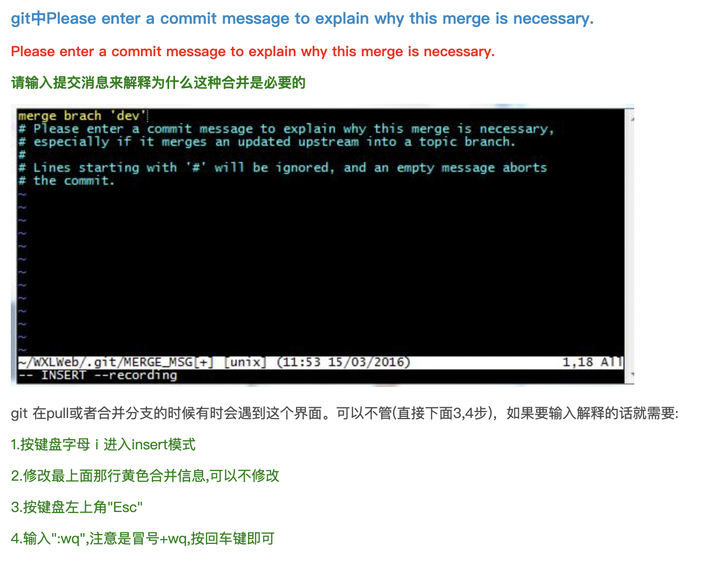

## 1、Git的使用

<u><font bgcolor = "blue" color = "red">先了解常用的终端命令:(可以上网去查  eg: cd、ls、cd ..) pwd</font></u>

### 1.1、 检查git是否安装成功  

> git --version

### 1.2、 git的设置操作步骤如下

---
#### 1.2.1、step 1:
> cd [把要进行版本控制的项目文件夹直接拖拽进来]

#### 1.2.2、step 2:
> git init

表示开始使用git, 并且开启了一个本地数据库, 终端如果显示Initialized empty Git repository in /xxx/xxx/xxx/your project name/.git/&emsp;&emsp;&emsp;, 则为创建成功

####1.2.3、 设定个人资料

- git config --global user.name "gon"
- 输入个人的email : git config --global user.email "gonsakon@gmail.com"
- 查询git设定内容 : git config --list

---

### 1.3、Git基本操作(查看状态然后提交)
- git status : 查看目前git状态  
	&emsp;&emsp;	&emsp;&emsp;<font color = "gree">情况1：</font>出现 Untraked files:... 表示目前文件没有被追踪  
	&emsp;&emsp;	&emsp;&emsp;<font color = "gree">情况2：</font>出现 No commits yet表示没有任何资料，即add(要追踪的)文件夹里面是空的  
	&emsp;&emsp;	&emsp;&emsp;<font color = "gree">情况3：</font>出现changes to be commit 表示已经add(添加了追踪, 自动添加了索引），但是还没有commit(提交)  常用于第一次add一个新的还没有被版本控制的文件，add第一次后自动添加了索引但是还没有commit  
	&emsp;&emsp;	&emsp;&emsp;<font color = "gree">情况4：</font>出现 changes not staged for commit 表示已经add(添加了追踪)，但是还没有添加索引,常指的是已经add(提交了)的文件[或者说已经进行了版本控制的文件]发生了修改但是还没第二次add.（加入追踪），所以索引没有发生改变(即更新)
	
- git add ./文件名 : 讲档案加入到索引(即追踪文件，将文件加上版本控制)
- git commit -m "修改内容(如xxx.java新增xxx类和在MainAty中调用了xxx方法)" : 将索引档案变成一个更新

### 1.4、Git基本操作
- git log : 查看commit历史记录
-  git reflog : 产看详细历史记录
- git clone <数据库地址> : 下载远端数据库
- git push -u origin(远端仓库名) master(本地分支名) : 更新远端数据库
- git push -u origin master : 更新远端数据库
//github因为要新建分支main所以要改为
git push -u origin main

###1.5、 Git查看索引版本操作
- git checkout 索引号(常常打前面几个字符然后按tap)
- git checkout master 重新回到最新版本

> reset 和 checkout 区别 ：reset是移动分支，checkout是移动HEAD

### 1.6、Git 版本还原操作
- git reset HEAD^(一个^代表还原一个版本) : 还原后任然保留最新的版本的档案
- git reset HEAD^ --hard : 还原后不保留最新的版本的档案

> 常常可以先git reflog查看历史记录,然后 git reset <历史记录中要还原版本索引号>,然后还原这个版本

### 1.7、Git删除文件操作
> 档案/文件还没有commit（提交）时的删除operation  

- git clean -n : 查看可以删除的文件(注意是创建后还没有commit的文件)
- git clean -f : 强制清除档案

> 档案/文件已经add（添加追踪）时的删除operation

- git checkout --<file名> 

> 档案commit（加入索引）时的删除operation

- git reset HEAD

### 1.8、 Git分支
- git branch devlop : 开启一个分支
- git branch : 查询现在有几条分支
- git checkout <分支名> : 切换到其他分支
-  git merge <分支名> : 合并分支，在同一条分支上（类似于: git commit -m "要修改的文件名"）
-  git merge <分支名> --no-ff : 合并分支，开辟一个节点分支，进行新的提交（常使用这种方式，便于更直观的看出开发中新增加的功能）

---

### 1.9、查看是否将项目提交到了远端
``` java
可以通过查看项目文件夹里面的config文件里的[remote "origin"]内容, 若出现url和fetch则表示提交成功 
```

### 2.0、Git不常用指令
> 1、编辑器更换 

- git config --global core.editor "code --wait"

> 2、Git缩写

- $ git config --global alias.co checkout
- $ git config --global alias.br branch
- $ git config --global alias.st status
- $ git config --global alias.ci commit

> 3、观看所有的config的设定

- git config --system --list ：查看系统config信息
- git config --global  --list ：查看当前用户（global）配置
- git config --local  --list ：查看当前仓库配置信息


### 2.1、删除git本地仓库
gitbash(Win)或终端(Mac)中执行

$ git init  
$ rm -rf .git

本地仓库就删除了  
执行&emsp;&emsp;$ git branch
该文件夹已经不是本地版本库了

### 2.2、远端内容修改合并本地端

pull 则是将远程主机的master分支最新内容拉下来后与当前本地分支直接合并 fetch+merge

```java
git pull origin master
  
```


## 2.3、**Git fetch和git pull的区别:**

都可以从远程获取最新版本到本地

### git fetch

**1.Git fetch:只是从远程获取最新版本到本地,不会`merge`(合并)**

```
$:git fetch origin master   //从远程的origin的master主分支上获取最新版本到origin/master分支上
$:git log -p master..origin/master //比较本地的master分支和origin/master分支的区别
$:git merge origin/master          //合并123
```

### git pull

**2.Git pull:从远程获取最新版本并`merge`(合并)到本地**

```
$:git pull origin master  //相当于进行了 git fetch 和 git merge两部操作1
```

### git pull和git fetch区别

实际工作中,可能`git fetch`更好一些, 因为在`merge`前,可以根据实际情况决定是否`merge`

------

## 2.4、error: You have not concluded your merge (MERGE_HEAD exists).报错原因

**再说导致报错:`error: You have not concluded your merge (MERGE_HEAD exists).`的原因可能是在以前pull下来的代码自动合并失败**

### 解决方法一

**解决办法一:保留本地的更改,中止合并->重新合并->重新拉取**

```
$:git merge --abort
$:git reset --merge
$:git pull
如果有选择界面，点击键盘A bort
```

### 解决方法二

**解决办法二:舍弃本地代码,远端版本覆盖本地版本(慎重)**

```
$:git fetch --all
$:git reset --hard origin/master
$:git fetch
```

 问题 ： git merge 是出现Merge remote-tracking branch 'ups/master'      原因：远程仓库有人提交，本地仓库commit了1次      解决方案: git rebase -i HEAD~2

插入值: